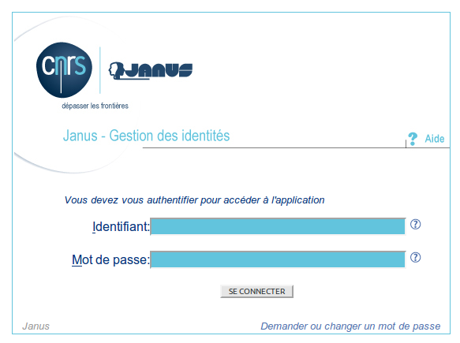
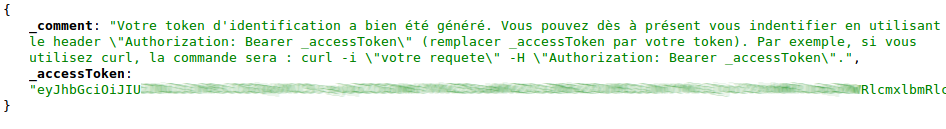

# Authentification par fédération d'identités

Tout comme le mode nomade, ce mode d'authentification est **indépendant de votre localisation géographique**. Il permet à tout personnel de l'Enseignement Supérieur et de la Recherche (ESR) d'accéder à l'ensemble des ressources de l'API sans demande d'autorisation préalable. Pour ce faire, l'API va déléguer le mécanisme d'identification à la fédération d'identité de Renater, qui vous redirigera vers votre fournisseur d'identité (ex : Janus pour le CNRS).

Ce mode d'authentification peut être exploité de 2 manières :

* de manière complètement transparente, lorsque l'API est interfacée dans un site web
* de manière programmatique, ce qui est utile pour extraire des sous-corpus issus de la plateforme Istex, par exemple

## Accès depuis un portail ou un site ayant intégré l'API

Si vous accédez aux ressources Istex via un portail ou un site web qui communique de manière transparente à l'API, vous n'avez pas de démarche particulière à effectuer. Lorsque cela sera nécessaire, vous serez automatiquement redirigé :

1. sur la page de choix de votre établissement
2. chez votre fournisseur d'identité, qui vous demandera de saisir vos identifiants habituels (ou votre certificat si vous en possédez un)
3. la redirection vers la page demandée initialement est automatique

_Page de choix de votre établissement (comptes CRU non autorisés)_


_Exemple de formulaire de connexion d'un fournisseur d'identité : ici **Janus**, qui est utilisé pour les personnels CNRS_



Note à l'attention des webmestres et responsables techniques des portails désirant intégrer ce\
processus :\
Pour déclencher la redirection vers la page Renater de choix de l'établissement (WAYF), il suffit d'ajouter le paramètre d'URL `auth=fede` aux requêtes HTTP faites à l'API Istex.

Exemple :

[https://api.istex.fr/document/3FAFD9ADF8DBB17F09F40AA390F704F9CAF041F6/fulltext/pdf?**auth=fede**](https://api.istex.fr/document/3FAFD9ADF8DBB17F09F40AA390F704F9CAF041F6/fulltext/pdf?auth=fede)

## Accès programmatique, via un token d'identification

Pour rappel, ce mode d'accès peut être utile dans le cadre de vos travaux de recherche si vous avez besoin de constituer un sous-corpus issu des ressources Istex. De manière générale, ce mode d'accès est utile à partir du moment où vous souhaitez scripter et automatiser les requêtes à l'API.

La mise en place de cet accès se fait en deux temps :

1. la génération d'un "token" (ou jeton) personnel, lié à votre compte chez votre fournisseur d'identité
2. l'utilisation de ce token lors de l'accès aux ressources protégées.

**Note importante :**


Le token mis en oeuvre dans cette méthode est **strictement personnel**. Il ne doit **en aucun cas être partagé** avec d'autres personnes, y compris vos collègues proches. Ceux-ci pourront aisément en obtenir un eux-mêmes.\
Il ne doit pas non plus être utilisé pour interfacer l'API dans un site web tiers : l'authentification par adresse IP ou via le paramètre d'URL `auth=fede` sont faits pour ça.\
Dans le cas où votre token personnel serait diffusé et utilisé par une personne non autorisée, votre responsabilité pourrait être engagée


### **1ère étape : génération du token**

Pour générer un nouveau token, connectez-vous à l'adresse [https://api.istex.fr/token/](https://api.istex.fr/token/) dans votre navigateur.\
Vous serez automatiquement redirigés vers le mécanisme d'authentification par fédération d'identité (cf paragraphe précédent).\
Une fois l'authentification effectuée, vous serez redirigés vers l'API Istex, qui vous communiquera votre token dans une réponse au format JSON, comme illustré sur l'image suivante :



Le token est disponible dans le champ `_accessToken`. Ce token suit le format standard JWT. Consulter le site [https://jwt.io](https://jwt.io) pour plus de détails

### **2ème étape : utilisation du token**

Maintenant que vous disposez d'un token valide, vous n'avez plus qu'à l'inclure à vos requêtes pour pouvoir accéder aux URL protégées de l'API.

Pour ce faire, vous devez utiliser le header HTTP `Authorization` et lui donner la valeur `Bearer ${TOKEN}` (remplacer ${TOKEN} par la vraie valeur de votre token)

_Exemple d'utilisation en ligne de commande :_

```bash
curl -i "https://api.istex.fr/document/${ID_ISTEX}/fulltext/pdf" -H "Authorization: Bearer ${TOKEN}" -o output.pdf
```

Si vous remplacez ${ID\_ISTEX} par un identifiant Istex et ${TOKEN} par votre token valide, cette commande téléchargera la ressource au format PDF dans le fichier `output.pdf`

Ce principe est adaptable à n'importe quel langage de programmation, bibliothèque ou outil qui implémente le protocole HTTP.

**Note importante :**

Pour le moment, les tokens générés sont valides pour une durée indéterminée. L'ensemble des tokens sont chiffrés à l'aide d'une "passphrase" privée stockée sur nos serveurs. Par conséquent, l'ensemble des token pourra être révoqué lorsque nous modifierons cette "passphrase".
