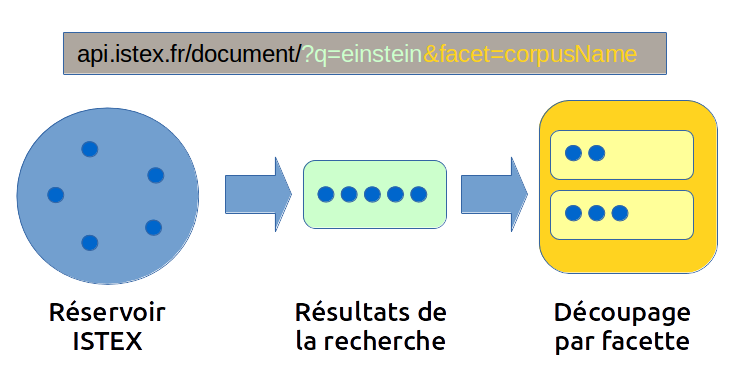

# Qu'est-ce qu'une facette ?

Une facette est un moyen de **filtrer sur une collection de données**. Elle agit en complément de la requête, en se basant sur celle-ci.

\_\_[_Pour apprendre à utiliser les facettes de l'API_ ](https://istex-tutorial.data.istex.fr/ark:/67375/Q05-WK6G6P8P-M) _n'hésitez pas à consulter le tutoriel multimédias_ 

