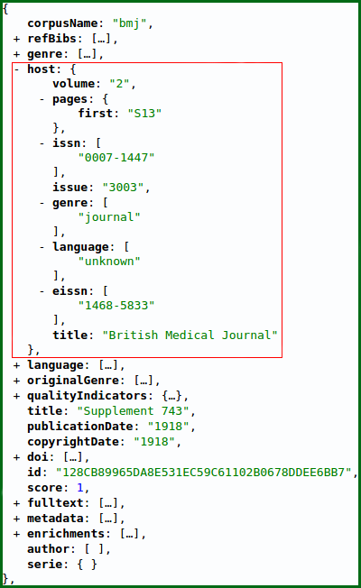

# Explication sur la granularité

La granularité désigne le **niveau hiérarchique des documents** pris en compte dans l’API. En effet, pour les ressources de **type journal**, l’information peut porter **tantôt sur la revue, tantôt sur l’article, parfois même sur la série**.

Au niveau de l’API, un enregistrement sera toujours pris **au niveau de l’article** \(cadre vert\). Un bloc spécial, `host`, permet d’accéder aux informations de **niveau revue** \(cadre rouge\). Ce bloc rouge sera donc **identique pour tous les articles d’une même revue**.

Lorsque l’objet documentaire est de **type monographie ou livre électronique**, le niveau de granularité de l’API est le **chapitre** \(cadre vert\). Le cadre rouge contiendra toutes les informations correspondant au **livre**.

