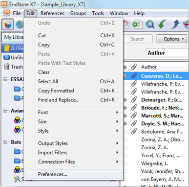
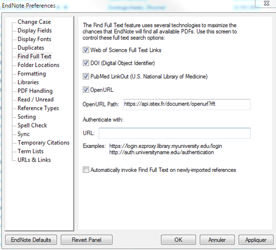
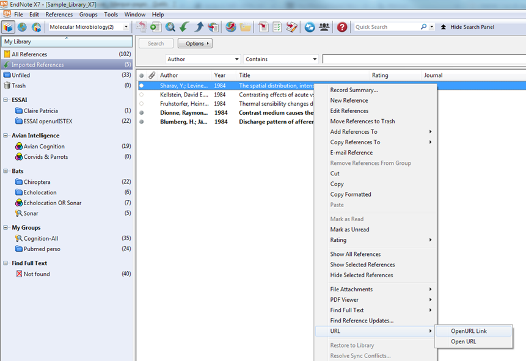
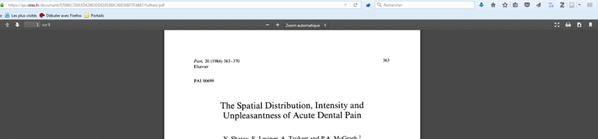
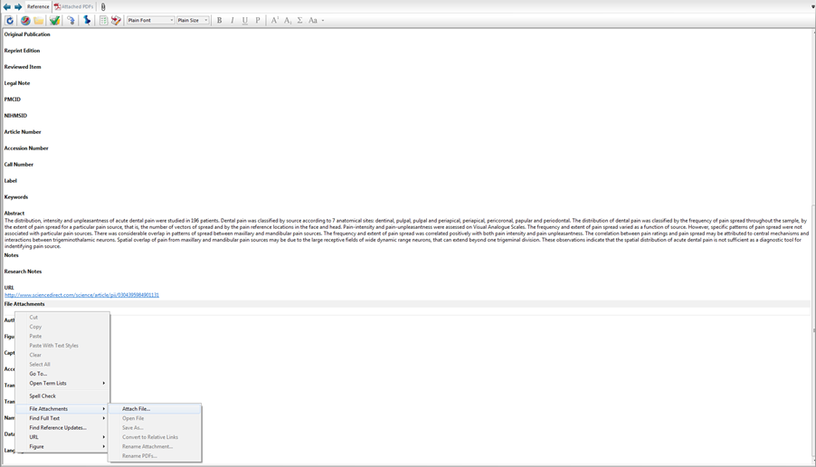
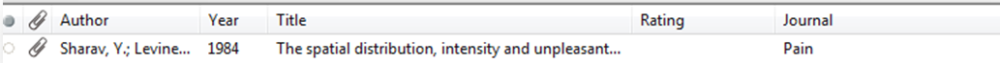

# EndNote

## Paramètrage du module Préférences

* Aller dans le menu **"Edit"**
* Choisir **"Preference"**

* Dans "**EndNote Preferences"** aller dans **"Find Full Text"**
* Renseigner au niveau de **"Open URL Path"** le résolveur OpenURL ISTEX `https://api.istex.fr/document/openurl?rft`
* Cliquer sur **"Appliquer"**

## Accès au PDF après une recherche

* Sélectionner la notice ou les notices bibliographiques
* Clic droit /**"URL"**/**"Open URL Link"**

* **"Enregistrer dans EndNote"** le PDF trouvé

* Ouvrir la **"Reference"** concernée
* Dans le champ **"File Attachments"**/**"Attach file"**
* Chercher le PDF et **"Enregistrer"**

* Un trombone signale la présence du PDF

