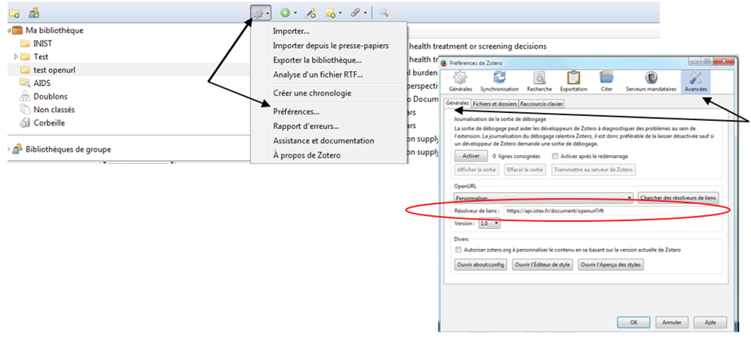
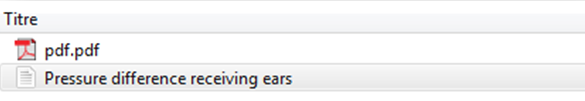
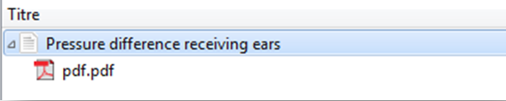

# Zotero

## Paramètrage du module Préférences

* Aller dans le menu **"Actions"**
* Choisir **"Préférences" de Zotéro**
* Cliquer sur **"Avancées"**
* Sélectioner l'onglet **"Générales"**

* Renseigner au niveau de **"Résolveur de liens"** l'OpenURL ISTEX `https://api.istex.fr/document/openurl?rft`
* N'oublier pas de choisir la **version 1.0** pour l'OpenURL


Un seul résolveur de liens OpenURL possible


## Accès au PDF après une recherche

* Cliquer sur la flèche verte **"Localiser"**
* Choisir **"Recherche dans la bibliothèque"** qui permet de rechercher le ou les documents sélectionnés en utilisant le résolveur de liens OpenURL renseigné dans le module **"Préférences"** de Zotéro.

* **"Enregistrer dans Zotero"** le PDF

* Faire glisser le PDF dans la notice

