# Extension ISTEX

### **L'extension de navigateur Istex n'est plus maintenue et ne peut plus être installée =>**[ **Installez l'extension Click\&Read**](extension-click-and-read.md)

### &#x20;

_"L 'extension ISTEX", communément appelé "Bouton" est une extension à installer dans un navigateur, Chrome ou Firefox. Une fois installé dans votre navigateur, il analysera l'ensemble des pages visitées à la recherche d'identifiants documentaires (DOI, PII, PMID, COinS...) et ajoutera des boutons cliquables « ISTEX » d’accès au plein-texte PDF lorsque le document est disponible dans la plateforme ISTEX._

_Installez le en vous rendant sur_ [_**https://addons.istex.fr**_](https://addons.istex.fr/)

_Voici à quoi ressembleront les boutons ISTEX cliquables qui apparaîtront dans les pages web au plus près des références bibliographiques :_

_Le bouton « ISTEX » peut s’activer notamment sur les pages_ [_Wikipédia_](https://fr.wikipedia.org/wiki/H%C3%A9lium)_,_ [_Google Scholar_](https://scholar.google.fr/scholar?hl=fr\&as\_sdt=0%2C5\&q=brain\&btnG=)_, Scopus, ou même HAL augmentant ainsi la visibilité et la diffusion des ressources ISTEX sans avoir à proposer un nouveau portail documentaire à l'utilisateur final._

_Comme pour tous les autres modes d’accès au PDF (_[_widgets_](https://widgets.istex.fr)_,_ [_démonstrateur_](http://demo.istex.fr)_…) il est limité aux ayants droit ISTEX, c'est-à-dire les personnels de l'Enseignement Supérieur et de la Recherche._

_En tâche de fond, cette extension fait un usage intensif du_ [_**service de résolution OpenURL de l’API ISTEX**_](../api/openurl/)_._

_Vous trouverez ci-dessous comment l'installer étape par étape pour les différents navigateurs web._

## _Firefox_

### **L'extension de navigateur Istex n'est plus maintenue et ne peut plus être installée =>**[ **Installez l'extension Click\&Read**](extension-click-and-read.md)

_=> La recherche sur Wikipédia d’_[_**« Hélium »**_](https://fr.wikipedia.org/wiki/H%C3%A9lium) _donne la bibliographie suivante :_

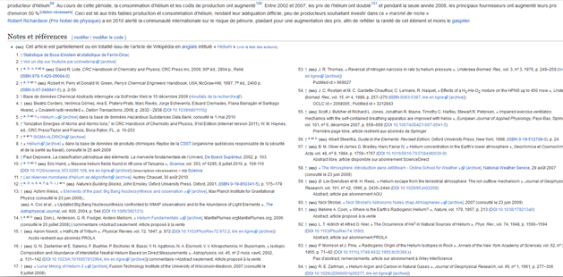

_=> Aller sur_ [_**https://addons.istex.fr**_](https://addons.istex.fr/)

_=> Cliquer sur « Ajouter l’extension à Firefox »_

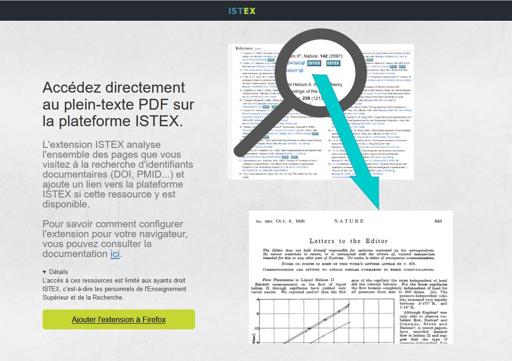

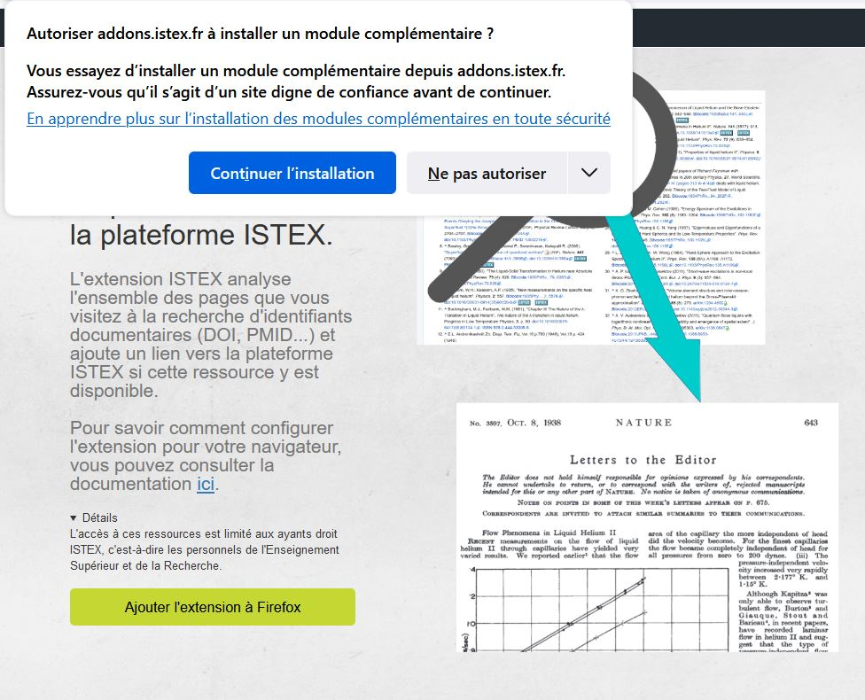

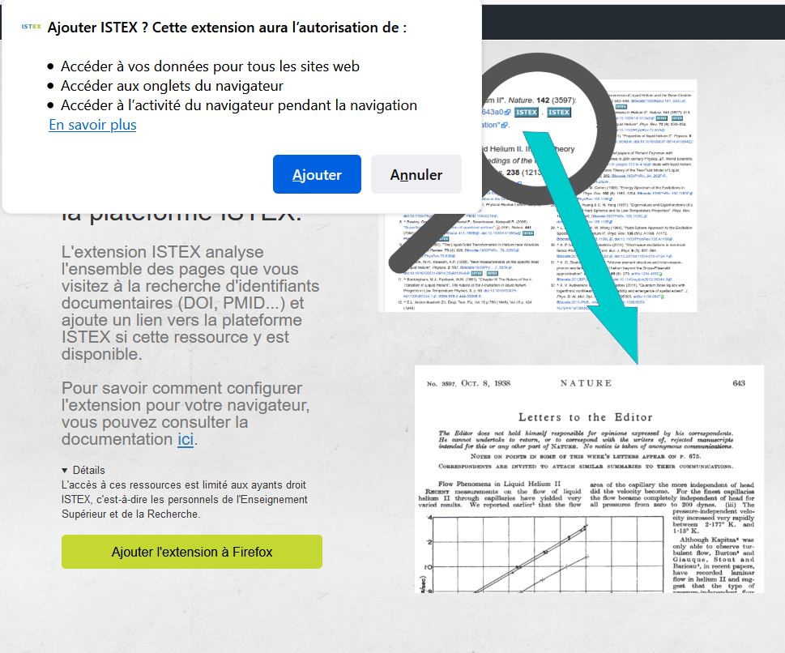

_=> Autoriser l’installation_

_Retrouver l’extension dans « Ouvrir le menu/Modules/Extensions »_

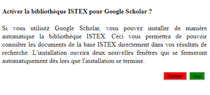

_=> Un écran propose alors la possibilité d’avoir un lien vers la bibliothèque ISTEX sur Google Scholar en cliquant sur «Oui» sans avoir besoin de l’installer_

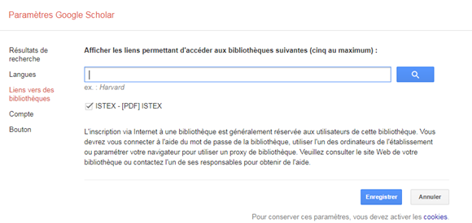

_=> En cliquant «Passer » pas de lien vers la bibliothèque ISTEX_

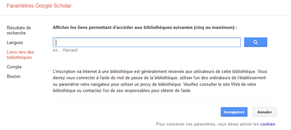

_=> Recharger la page de Wikipédia « Ctrl F5 »_

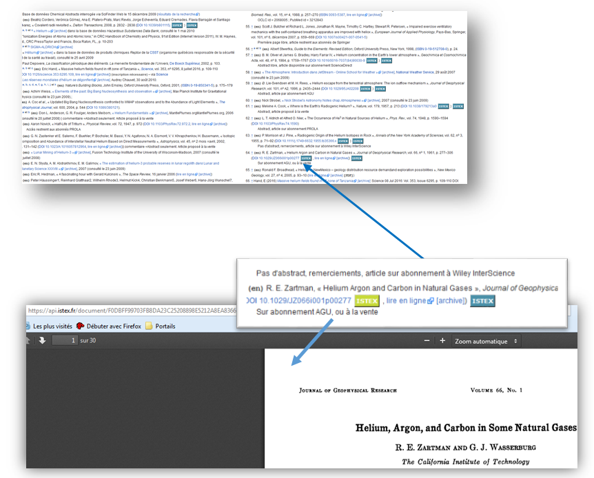

## _Chrome_

### **L'extension de navigateur Istex n'est plus maintenue et ne peut plus être installée =>**[ **Installez l'extension Click\&Read**](extension-click-and-read.md)

_=> La recherche sur Wikipédia d’_[_**« Hélium »**_](https://fr.wikipedia.org/wiki/H%C3%A9lium) _donne la bibliographie suivante :_

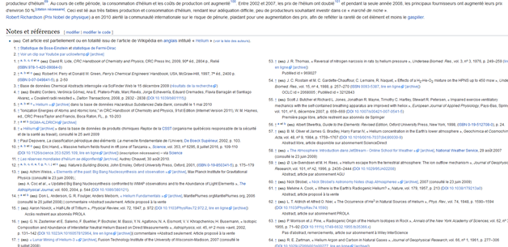

_=> Aller sur_ [_**htt**_](https://addons.istex.fr/)[_**ps://addons.istex.fr**_](https://addons.istex.fr/)

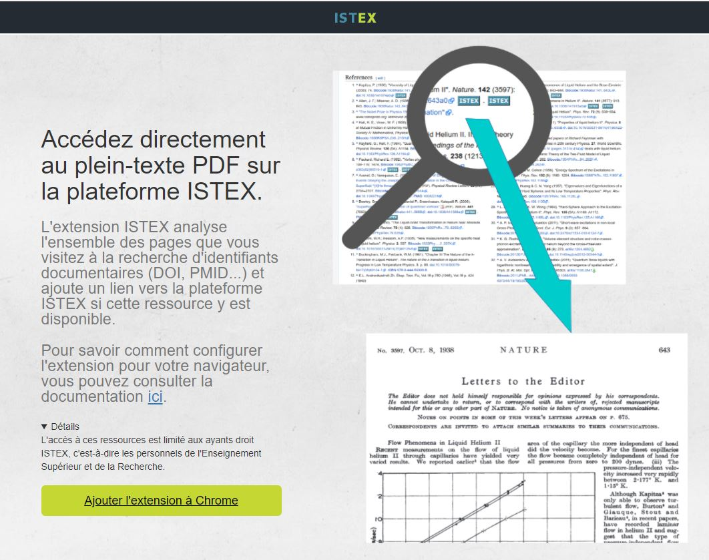

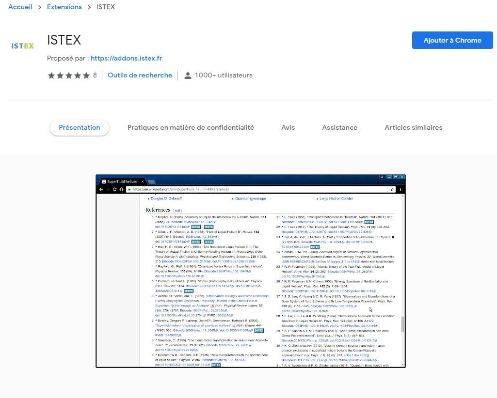

_=> Cliquer sur « Ajouter l’extension à Chrome »_

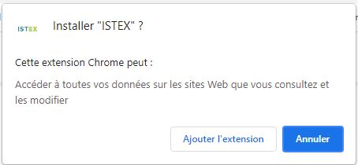

_=> Autoriser l’installation_

_Retrouver l’extension dans « Personnaliser et contrôler Google Chrome/Plus d'outils/Extensions »_

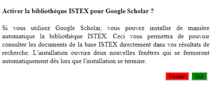

_=> Un écran propose alors la possibilité d’avoir un lien vers la bibliothèque ISTEX sur Google Scholar en cliquant sur «Oui» sans avoir besoin de l’installer_

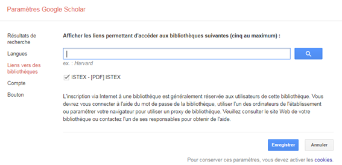

_=> En cliquant «Passer » pas de lien vers la bibliothèque ISTEX_

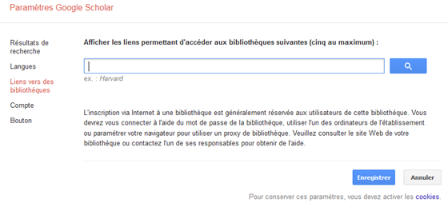

\=_> Recharger la page de Wikipédia « Ctrl F5 »_

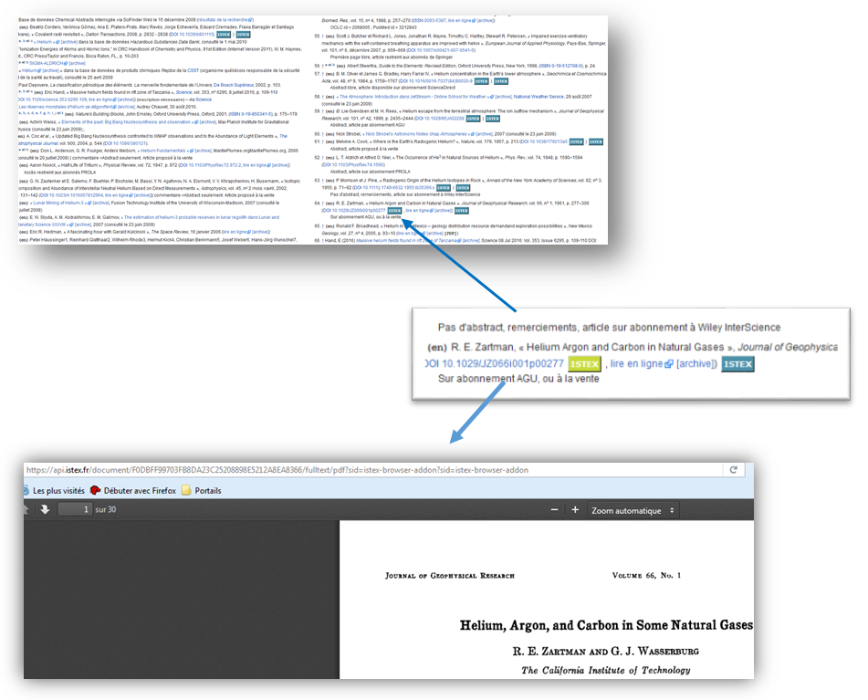
