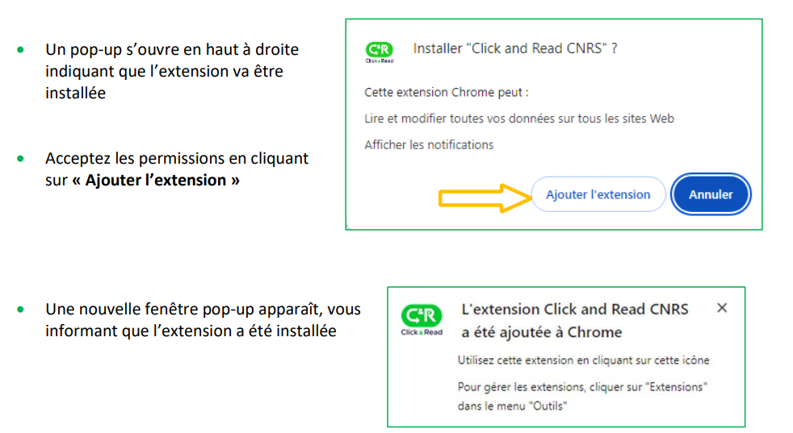
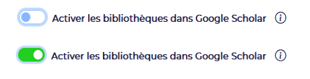
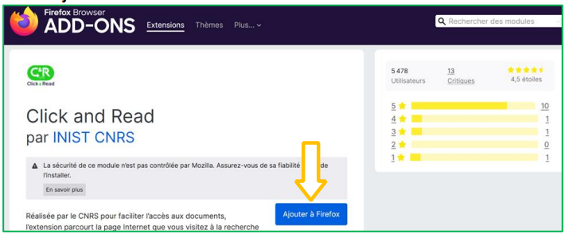
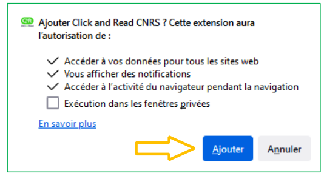
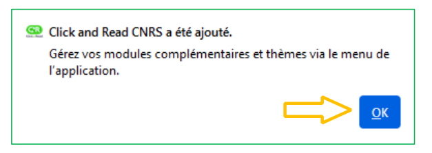

# Extension Click & Read

L’extension Click & Read CNRS, tout comme l'était l’extension Istex, est une **extension de navigateur web développée pour Firefox, Chrome, Opera et Safari (à partir de l'OS 14)**

Elle est aussi installable sur les navigateurs basés Chromium, comme Brave ou Edge (à partir de la version 2021).

L'extension Click & Read **remplace et unifie** les 3 extensions existantes des plateformes gérées par l'Inist-CNRS **Istex**, **Panist** et **BibCnrs**, auxquelles s'ajoute l'extension libre **Unpaywall**.

L'extension Click & Read reprenant les fonctionnalités de l’extension Istex il est préférable de la désinstaller. Pour rappel l'extension Istex n'est plus disponible à l'installation (lire : [L’extension Istex n’est plus… Vive l’extension Click\&Read](https://www.istex.fr/lextension-istex-nest-plus-vive-lextension-clickread/))

Cette extension est destinée aux personnels de l'Enseignement Supérieur et de la Recherche (ESR).


**Unpaywall** : ressources scientifiques en accès libre. Pas de droits d’accès.

_L’accès aux ressources est limité selon la source consultée aux ayants droit :_

**BibCnrs** (communautés de recherche du CNRS)

**Istex** (communauté de l’Enseignement Supérieur et de la Recherche Française)

**Panist** (communauté des établissements membres des contrats d’abonnement)


L’extension **Click & Read** parcourt la page internet que vous visitez à la recherche uniquement d’identifiants documentaires (DOI, PMID, PII) et ajoute le bouton C\&R si la ressource est disponible. Il suffit alors de cliquer sur le bouton pour accéder au document.&#x20;


Pour en savoir plus : [https://clickandread.inist.fr/info](https://clickandread.inist.fr/info)


**Installer l'extension Click & Read sur :**

## **Chrome**

* Cliquez sur [https://clickandread.inist.fr](https://clickandread.inist.fr)
* Cliquez sur le bouton « _Ajouter l’extension à Chrome_ »

<figure><figcaption></figcaption></figure>

* Vous devez également Accepter ou Refuser la politique de confidentialité
* &#x20;Paramétrez l’extension Click & Read pour ouvrir vos droits

**Choisissez** votre établissement d’appartenance, si votre établissement ne figure pas dans la liste, sélectionner « _Autre_ »


La sélection de votre établissement génère automatiquement les sources pour lesquelles vous êtes   ayants droit


Si vous êtes ayants droit CNRS, **sélectionnez « CNRS » dans « Etablissement(s) d’appartenance »**, puis cochez uniquement votre ou vos domaines de rattachement.

<figure><figcaption></figcaption></figure>

Puis vous pouvez **ordonner vos sources** par « Glisser/Déposer »&#x20;

<figure><figcaption></figcaption></figure>

**Activez**, si vous le souhaitez, les bibliothèques Istex et BibCnrs dans **Google Scholar**

<figure><figcaption></figcaption></figure>

**Enregistrez**

&#x20;En navigant sur Internet :

* quel que soit le site (Google, Google Scholar, sites éditeurs, Wikipédia...)&#x20;
* quelle que soit la requête (titre article, auteurs, DOI...)&#x20;
* l'extension Click & Read parcourt la page Internet que vous visitez à la recherche uniquement d'identifiants documentaires DOI, PMID, PII (identifiant Elsevier)&#x20;
* puis recherche le document qui correspond à l'identifiant trouvé dans les fonds : Unpaywall, Istex, Panist et BibCnrs&#x20;
* et ajoute le bouton C & R si la ressource est disponible
* il suffit alors de cliquer sur le bouton pour accéder au document.

&#x20;Exemple : la recherche sur Wikipédia d’« [Hélium](https://fr.wikipedia.org/wiki/H%C3%A9lium) » donne la bibliographie suivante

Pour toute question contacter l'équipe [clickandread@inist.fr](mailto:)

## &#x20;Firefox

* Cliquez sur [https://clickandread.inist.fr](https://clickandread.inist.fr)
* Puis sur le bouton "Ajouter l'extension à Firefox"
* Cliquez sur le bouton « Ajouter à Firefox »

<figure><figcaption></figcaption></figure>


Ne pas tenir compte du message « la sécurité de ce module n’est pas contrôlée par Mozilla ». La fiabilité de l’extension est assurée à la fois au travers des examens de validation pour publication sur le Store de Firefox par Mozilla, et de la maintenance évolutive et curative du code source de l'extension par l’INIST-CNRS. Pour fonctionner Click & Read doit accéder à toutes les pages et les analyser : le code de l’extension Click & Read n’accède qu’aux identifiants des ressources documentaires. Click & Read n’enregistre aucune information personnelle.


* Une pop-up s’ouvre en haut à droite indiquant que l’extension va être installée
* Si vous souhaitez que l’extension puisse s’exécuter dans une fenêtre de navigation privée, cochez la case prévue à cet effet
* Acceptez les permissions en cliquant sur « Ajouter »

<figure><figcaption></figcaption></figure>

* Cliquez sur « OK »

<figure><figcaption></figcaption></figure>

* Vous devez également Accepter ou Refuser la politique de confidentialité
* Paramétrer l’extension Click & Read pour ouvrir vos droits

**Sélectionnez** votre ou vos établissement(s) d’appartenance, soit en déroulant la liste ou en saisissant le nom de votre établissement Exemple : « Université de Lorraine ». Si votre établissement ne figure pas dans la liste, sélectionner « _Autre_ »Comment

<figure><figcaption></figcaption></figure>

La sélection de votre établissement génère automatiquement les sources pour lesquelles vous êtes ayants droit.

Si vous êtes ayants droit CNRS, **sélectionnez « CNRS » dans « Etablissement(s) d’appartenance »**, puis cochez uniquement votre ou vos domaines de rattachement.

<figure><figcaption></figcaption></figure>

Puis vous pouvez **ordonner vos sources** par « Glisser/Déposer »

<figure><figcaption></figcaption></figure>

<figure><figcaption></figcaption></figure>

**Enregistrez** vos paramètres de C & R en cliquant sur « Enregistrer»

&#x20;En navigant sur Internet :

* quel que soit le site (Google, Google Scholar, sites éditeurs, Wikipédia...)&#x20;
* quelle que soit la requête (titre article, auteurs, DOI...)&#x20;
* l'extension Click & Read parcourt la page Internet que vous visitez à la recherche uniquement d'identifiants documentaires DOI, PMID, PII (identifiant Elsevier)&#x20;
* puis recherche le document qui correspond à l'identifiant trouvé dans les fonds : Unpaywall, Istex, Panist et BibCnrs&#x20;
* et ajoute le bouton C & R si la ressource est disponible
* il suffit alors de cliquer sur le bouton pour accéder au document.

&#x20;Exemple : la recherche sur Wikipédia d’« [Hélium ](https://fr.wikipedia.org/wiki/H%C3%A9lium)» donne la bibliographie suivante

Pour toute question contacter l'équipe [clickandread@inist.fr](mailto:)[​](https://clickandread.inist.fr/page_info)

## Safari

* Cliquez sur [https://clickandread.inist.fr](https://clickandread.inist.fr)
* Cliquez sur le bouton « Ajouter l’extension à Safari »

* Cliquez sur « Ouvrir » puis sur « Quit and Open Safari Extensions Preferences »

* Cochez la case « Click and Read » et cliquez sur « Préférences »


Concernant l’information indiquée par Safari dans la partie jaune : pour fonctionner Click & Read doit accéder à toutes les pages et les analyser : le code de l’extension Click & Read n’accède qu’aux identifiants des ressources documentaires. Click & Read n’enregistre aucune information personnelle.


* Paramétrez l’extension Click & Read pour ouvrir vos droits

<figure><figcaption></figcaption></figure>


Votre établissement ne figure pas dans la liste, sélectionnez « _Autre_ »&#x20;


La sélection de votre établissement génère automatiquement les sources pour lesquelles vous êtes ayants droit.

Si vous êtes ayants droit CNRS, **sélectionnez** « CNRS » dans « Etablissement(s) d’appartenance », puis cochez uniquement votre ou vos domaines de rattachement

<figure><figcaption></figcaption></figure>

Puis vous pouvez **ordonner** vos sources par « Glisser/Déposer »

<figure><figcaption></figcaption></figure>

**Activez**, si vous le souhaitez, les bibliothèques Istex et BibCnrs dans **Google Scholar**

<figure><figcaption></figcaption></figure>

**Enregistrez**


A tout moment vous pouvez modifier votre paramétrage en cliquant sur le logo C\&R dans votre barre Firefox des extensions.


Cliquez sur l’icône C\&R dans la barre des extensions et sélectionner  «_Toujours autorisé sur chaque site web_ »

Cliquez à nouveau sur « _Toujours autoriser sur chaque site web_ »

En navigant sur Internet :

* quel que soit le site (Google, Google Scholar, sites éditeurs, Wikipédia...)&#x20;
* quelle que soit la requête (titre article, auteurs, DOI...)&#x20;
* l'extension Click & Read parcourt la page Internet que vous visitez à la recherche uniquement d'identifiants documentaires DOI, PMID, PII (identifiant Elsevier)&#x20;
* puis recherche le document qui correspond à l'identifiant trouvé dans les fonds : Unpaywall, Istex, Panist et BibCnrs&#x20;
* et ajoute le bouton C\&R si la ressource est disponible&#x20;
* il suffit alors de cliquer sur le bouton pour accéder au document.

Exemple : la recherche sur Wikipédia d’« [Hélium](https://fr.wikipedia.org/wiki/H%C3%A9lium) » donne la bibliographie suivante

Pour toute question contacter l'équipe [clickandread@inist.fr](mailto:)

