# Extension Click & Read

L’extension Click & Read CNRS, tout comme l’extension ISTEX, est une **extension de navigateur web développée pour Firefox, Chrome, Opera et Safari (à partir de l'OS 14)**

Elle est aussi installable sur les navigateurs basés Chromium, comme Brave ou Edge (à partir de la version 2021).

L'extension Click & Read **remplace et unifie** les 3 extensions existantes des plateformes gérées par l'Inist-CNRS **ISTEX**, **Panist** et **BibCnrs**, auxquelles s'ajoute l'extension libre **Unpaywall**.

L'extension Click & Read reprenant les fonctionnalités de l’extension ISTEX il est préférable de la désinstaller.

Cette extension est destinée aux personnels de l'Enseignement Supérieur et de la Recherche (ESR).


**Unpaywall** : ressources scientifiques en accès libre. Pas de droits d’accès.

_L’accès aux ressources est limité selon la source consultée aux ayants droit :_

**BibCnrs** (communautés de recherche du CNRS)

**ISTEX** (communauté de l’Enseignement Supérieur et de la Recherche Française)

**Panist** (communauté des établissements membres des contrats d’abonnement)


L’extension **Click & Read** parcourt la page internet que vous visitez à la recherche uniquement d’identifiants documentaires (DOI, PMID, PII) et ajoute le bouton C\&R si la ressource est disponible. Il suffit alors de cliquer sur le bouton pour accéder au document.&#x20;


Pour en savoir plus : [https://clickandread.inist.fr/info](https://clickandread.inist.fr/info)


**Installer l'extension Click & Read sur :**

## **Chrome**

\=> Cliquer sur [https://clickandread.inist.fr](https://clickandread.inist.fr)

\=> Cliquer sur le bouton « _Ajouter l’extension à Chrome_ »

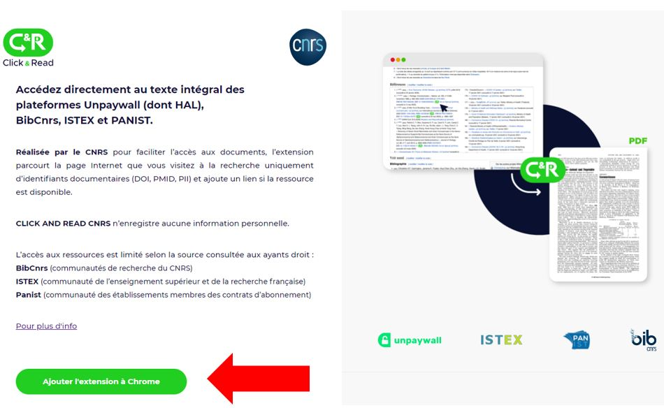

\=>  Cliquer sur « _Ajouter à Chrome_ »

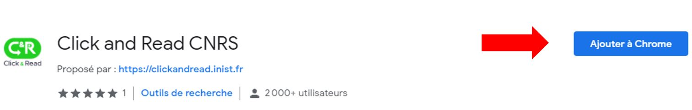

\=> Accepter les permissions en cliquant sur « _Ajouter l’extension_ »

_=>_ Un message vous avertit que votre extension est installée

\=> Paramétrer l’extension Click & Read pour ouvrir vos droits

1. Choisir votre établissement d’appartenance, si votre établissement ne figure pas dans la liste, sélectionner « _Autre_ »
2. Préciser si vous êtes utilisateur de BibCnrs, si oui sélectionner votre / vos domaine(s)&#x20;
3. Activer, si vous le souhaitez, les bibliothèques ISTEX et BibCnrs dans Google Scholar
4. Enregistrer


A tout moment vous pouvez modifier votre paramétrage en cliquant sur le logo C\&R dans votre barre Chrome des extensions.


\=> En navigant sur Internet :

* quel que soit le site (Google, Google Scholar, sites éditeurs, Wikipédia...)&#x20;
* quelle que soit la requête (titre article, auteurs, DOI...)&#x20;
* l'extension Click & Read parcourt la page Internet que vous visitez à la recherche uniquement d'identifiants documentaires DOI, PMID, PII (identifiant Elsevier)&#x20;
* puis recherche le document qui correspond à l'identifiant trouvé dans les fonds : Unpaywall, Istex, Panist et BibCnrs&#x20;
* et ajoute le bouton C\&R si la ressource est disponible
* il suffit alors de cliquer sur le bouton pour accéder au document.

\=>  Exemple : la recherche sur Wikipédia d’« [Hélium](https://fr.wikipedia.org/wiki/H%C3%A9lium) » donne la bibliographie suivante

[En savoir plus](https://clickandread.inist.fr/page_info)&#x20;

## Firefox

\=> Cliquer sur [https://clickandread.inist.fr](https://clickandread.inist.fr)

\=> Cliquer sur le bouton « _Ajouter l’extension à Firefox_ »

\=> Cliquer sur « _Ajouter à Firefox_ »

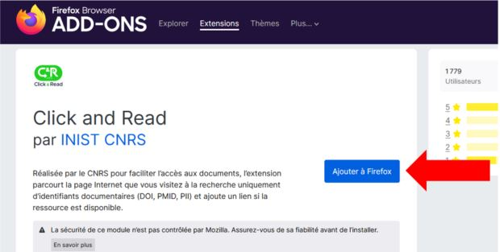

\=> Accepter les permissions en cliquant sur « _Ajouter_ »

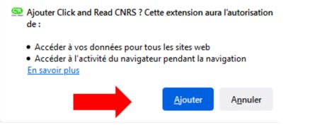

\=> Une pop-up s'ouvre en haut à droite, cliquer sur  « _OK_ » et l'extension s'installe

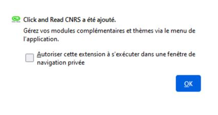

\=> Paramétrer l’extension Click & Read pour ouvrir vos droits

.png>)

1. Choisir votre établissement d’appartenance, si votre établissement ne figure pas dans la liste, sélectionner « _Autre_ »
2. Préciser si vous êtes utilisateur de BibCnrs, si oui sélectionner votre / vos domaine(s)&#x20;
3. Activer, si vous le souhaitez, les bibliothèques ISTEX et BibCnrs dans Google Scholar
4. Enregistrer


A tout moment vous pouvez modifier votre paramétrage en cliquant sur le logo C\&R dans votre barre Firefox des extensions.&#x20;


\=> En navigant sur Internet :

* quel que soit le site (Google, Google Scholar, sites éditeurs, Wikipédia...)&#x20;
* quelle que soit la requête (titre article, auteurs, DOI...)&#x20;
* l'extension Click & Read parcourt la page Internet que vous visitez à la recherche uniquement d'identifiants documentaires DOI, PMID, PII (identifiant Elsevier)
* puis recherche le document qui correspond à l'identifiant trouvé dans les fonds : Unpaywall, Istex, Panist et BibCnrs&#x20;
* et ajoute le bouton C\&R si la ressource est disponible&#x20;
* il suffit alors de cliquer sur le bouton pour accéder au document.

\=> Exemple : la recherche sur Wikipédia d’« [Hélium ](https://fr.wikipedia.org/wiki/H%C3%A9lium)» donne la bibliographie suivante

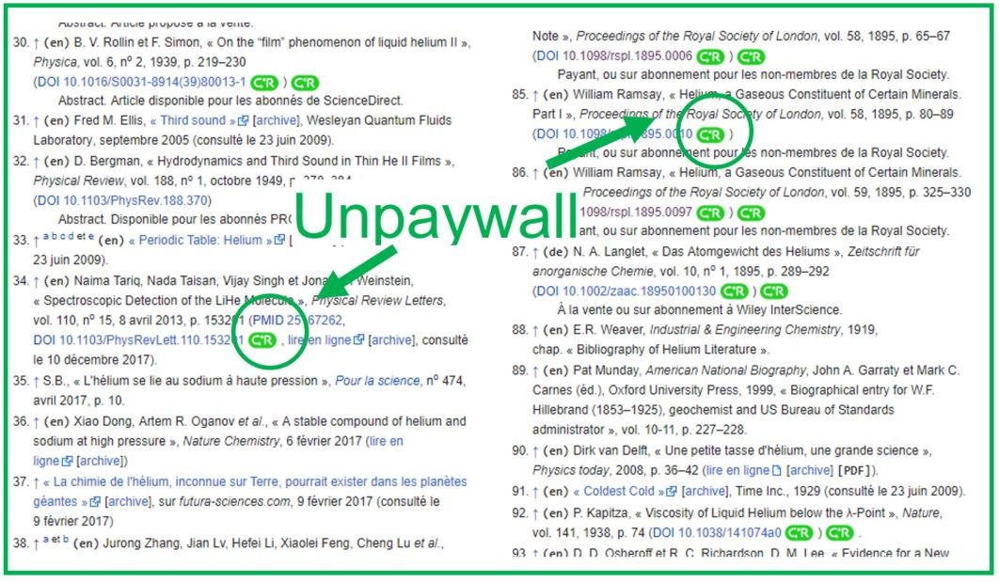

[​En savoir plus](https://clickandread.inist.fr/page_info)

## Safari

\=> Cliquer sur [https://clickandread.inist.fr](https://clickandread.inist.fr)

\=> Cliquer sur le bouton « _Ajouter l’extension à Safari_ »

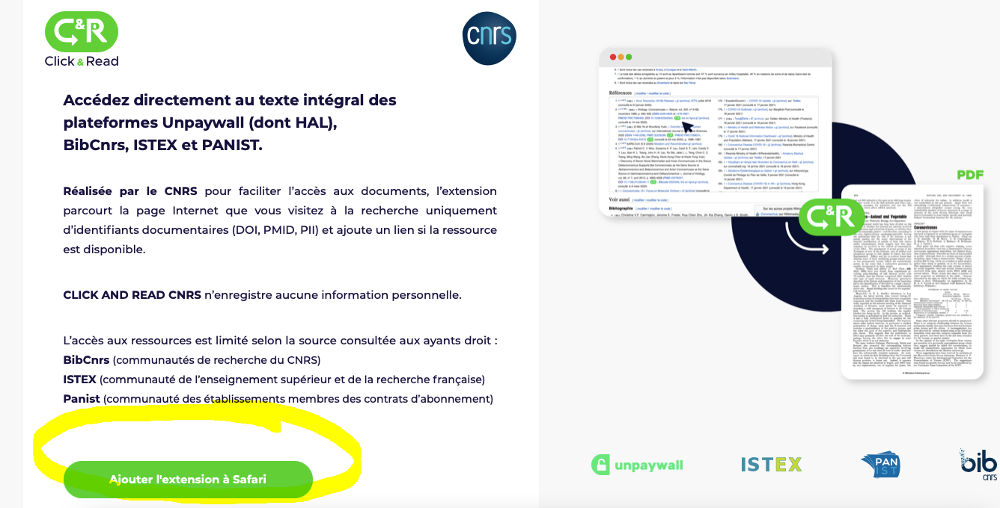

\=> Cliquer sur « _Ouvrir_ » puis sur « _Quit and Open Safari Extensions Preferences_ »

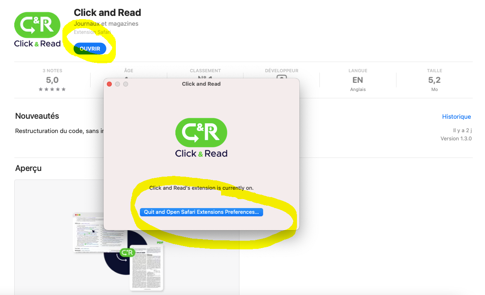

\=> Cocher la case « _Click and Read_ » et cliquer sur « _Préférences_ »

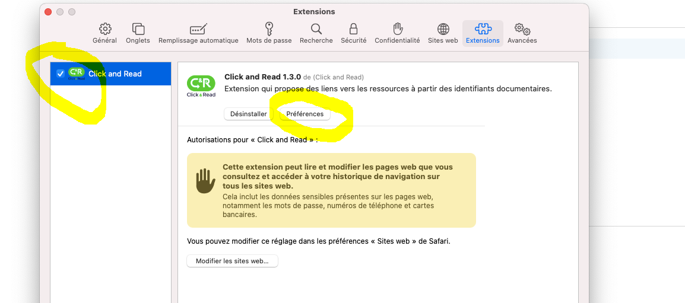

\=> Paramétrer l’extension Click & Read pour ouvrir vos droits

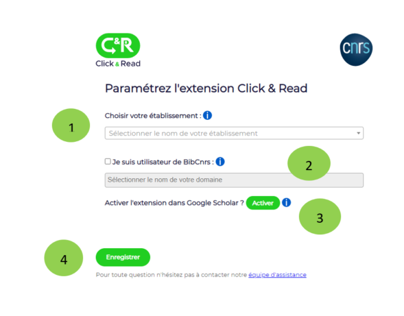

1. Choisir votre établissement d’appartenance, si votre établissement ne figure pas dans la liste, sélectionner « _Autre_ »&#x20;
2. Préciser si vous êtes utilisateur de BibCnrs, si oui sélectionner votre / vos domaine(s)&#x20;
3. Activer, si vous le souhaitez, les bibliothèques ISTEX et BibCnrs dans Google Scholar&#x20;
4. Enregistrer


A tout moment vous pouvez modifier votre paramétrage en cliquant sur le logo C\&R dans votre barre Firefox des extensions.


\=> Cliquer sur l’icône C\&R dans la barre des extensions et sélectionner  «_Toujours autorisé sur chaque site web_ »

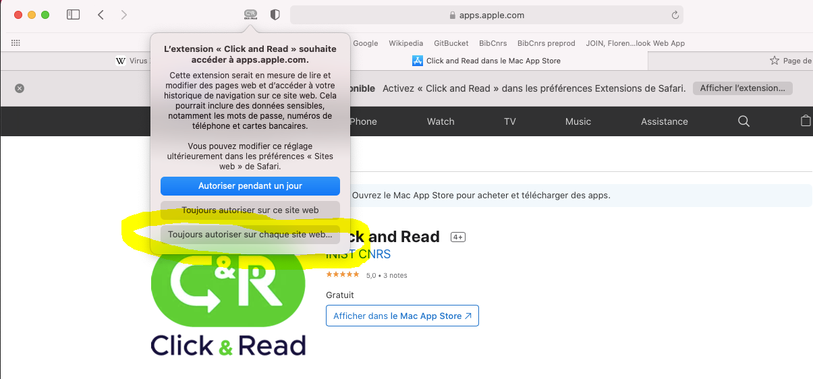

\=> Cliquer à nouveau sur « _Toujours autorisé sur chaque site web_ »

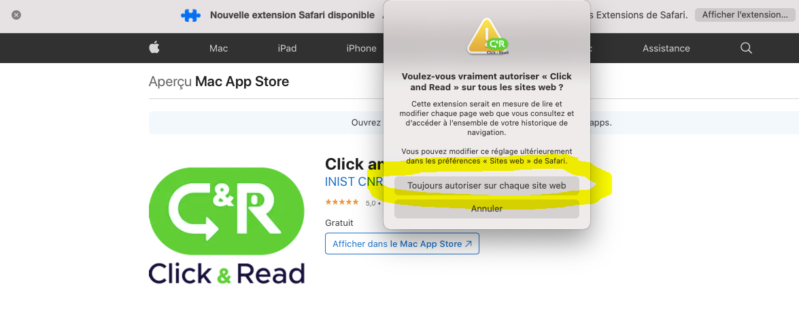

\=> En navigant sur Internet :

* quel que soit le site (Google, Google Scholar, sites éditeurs, Wikipédia...)&#x20;
* quelle que soit la requête (titre article, auteurs, DOI...)&#x20;
* l'extension Click & Read parcourt la page Internet que vous visitez à la recherche uniquement d'identifiants documentaires DOI, PMID, PII (identifiant Elsevier)&#x20;
* puis recherche le document qui correspond à l'identifiant trouvé dans les fonds : Unpaywall, Istex, Panist et BibCnrs&#x20;
* et ajoute le bouton C\&R si la ressource est disponible&#x20;
* il suffit alors de cliquer sur le bouton pour accéder au document.

\=> Exemple : la recherche sur Wikipédia d’« [Hélium](https://fr.wikipedia.org/wiki/H%C3%A9lium) » donne la bibliographie suivante

​[En savoir plus](https://clickandread.inist.fr/page_info)

