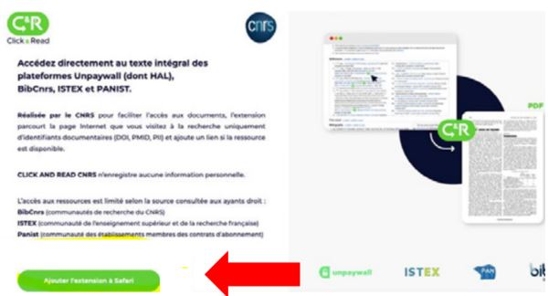

# Extension Click & Read

L’extension Click & Read CNRS, tout comme l’extension ISTEX, est une **extension de navigateur web développée pour Firefox, Chrome et Safari \(à partir de l'OS 14\)**

L'extension Click & Read **remplace et unifie** les 3 extensions existantes des plateformes gérées par l'Inist-CNRS **ISTEX**, **Panist** et **BibCnrs**, auxquelles s'ajoute l'extension libre **Unpaywall**.

L'extension Click & Read reprenant les fonctionnalités de l’extension ISTEX il est préférable de la désinstaller.

Cette extension est destinée aux personnels de l'Enseignement Supérieur et de la Recherche \(ESR\).


**Unpaywall** : ressources scientifiques en accès libre. Pas de droits d’accès.

_L’accès aux ressources est limité selon la source consultée aux ayants droit :_

**BibCnrs** \(communautés de recherche du CNRS\)

**ISTEX** \(communauté de l’Enseignement Supérieur et de la Recherche Française\)

**Panist** \(communauté des établissements membres des contrats d’abonnement\)


L’extension **Click & Read** parcourt la page internet que vous visitez à la recherche uniquement d’identifiants documentaires \(DOI, PMID, PII\) et ajoute le bouton C&R si la ressource est disponible. Il suffit alors de cliquer sur le bouton pour accéder au document. 

**Installer l'extension Click & Read sur :**

## **Chrome**

=&gt; Cliquer sur [https://clickandread.inist.fr](https://clickandread.inist.fr)

=&gt; Cliquer sur le bouton « _Ajouter l’extension à Chrome_ »

=&gt;  Cliquer sur « _Ajouter à Chrome_ »

=&gt; Accepter les permissions en cliquant sur « _Ajouter l’extension_ »

_=&gt;_  Un message vous avertit que votre extension est installée

=&gt; Paramétrer l’extension Click & Read pour ouvrir vos droits

1. Choisir votre établissement d’appartenance, si votre établissement ne figure pas dans la liste, sélectionner « _Autre_ »
2. Préciser si vous êtes utilisateur de BibCnrs , si oui sélectionner votre / vos domaine\(s\) 
3. Activer, si vous le souhaitez, les bibliothèques ISTEX et BibCnrs dans Google Scholar
4. Enregistrer


A tout moment vous pouvez modifier votre paramétrage en cliquant sur le logo C&R dans votre barre Chrome des extensions.


=&gt; En navigant sur Internet :

* quel que soit le site \(Google, Google Scholar, sites éditeurs, Wikipédia...\) 
* quelle que soit la requête \(titre article, auteurs, DOI...\) 
* l'extension Click & Read parcourt la page Internet que vous visitez à la recherche uniquement d'identifiants documentaires DOI, PMID, PII \(identifiant Elsevier\) 
* puis recherche le document qui correspond à l'identifiant trouvé dans les fonds : Unpaywall, Istex, Panist et BibCnrs 
* et ajoute le bouton C&R si la ressource est disponible
* il suffit alors de cliquer sur le bouton pour accéder au document.

=&gt;  Exemple : la recherche sur Wikipédia d’« [Hélium](https://fr.wikipedia.org/wiki/Hélium) » donne la bibliographie suivante

[En savoir plus](https://clickandread.inist.fr/page_info) 

## Firefox

=&gt; Cliquer sur [https://clickandread.inist.fr](https://clickandread.inist.fr)

=&gt; Cliquer sur le bouton « _Ajouter l’extension à Firefox_ »

=&gt; Cliquer sur « _Ajouter à Firefox_ »

=&gt; Accepter les permissions en cliquant sur « _Ajouter_ »

=&gt; Une pop-up s'ouvre en haut à droite, cliquer sur  « _OK_ » et l'extension s'installe

=&gt; Paramétrer l’extension Click & Read pour ouvrir vos droits

1. Choisir votre établissement d’appartenance, si votre établissement ne figure pas dans la liste, sélectionner « _Autre_ »
2. Préciser si vous êtes utilisateur de BibCnrs , si oui sélectionner votre / vos domaine\(s\) 
3. Activer, si vous le souhaitez, les bibliothèques ISTEX et BibCnrs dans Google Scholar
4. Enregistrer


A tout moment vous pouvez modifier votre paramétrage en cliquant sur le logo C&R dans votre barre Firefox des extensions. 


=&gt; En navigant sur Internet :

* quel que soit le site \(Google, Google Scholar, sites éditeurs, Wikipédia...\) 
* quelle que soit la requête \(titre article, auteurs, DOI...\) 
* l'extension Click & Read parcourt la page Internet que vous visitez à la recherche uniquement d'identifiants documentaires DOI, PMID, PII \(identifiant Elsevier\)
* puis recherche le document qui correspond à l'identifiant trouvé dans les fonds : Unpaywall, Istex, Panist et BibCnrs 
* et ajoute le bouton C&R si la ressource est disponible 
* il suffit alors de cliquer sur le bouton pour accéder au document.

=&gt; Exemple : la recherche sur Wikipédia d’« [Hélium ](https://fr.wikipedia.org/wiki/Hélium)» donne la bibliographie suivante

[​En savoir plus](https://clickandread.inist.fr/page_info)

## Safari

=&gt; Cliquer sur [https://clickandread.inist.fr](https://clickandread.inist.fr)

=&gt; Cliquer sur le bouton « _Ajouter l’extension à Safari_ »

