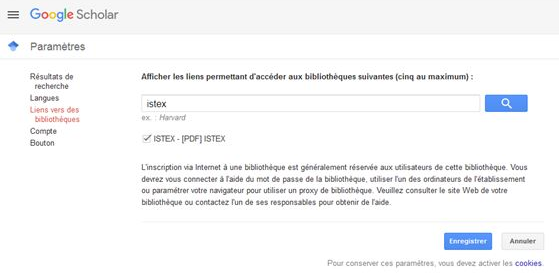
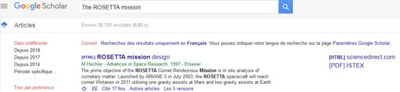
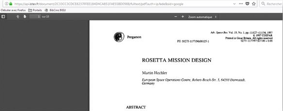
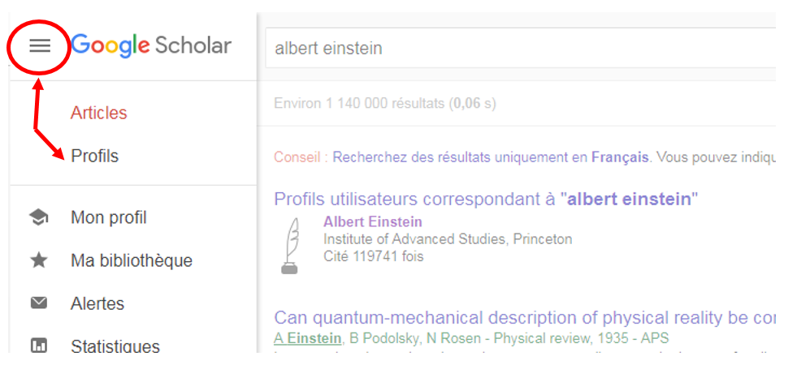
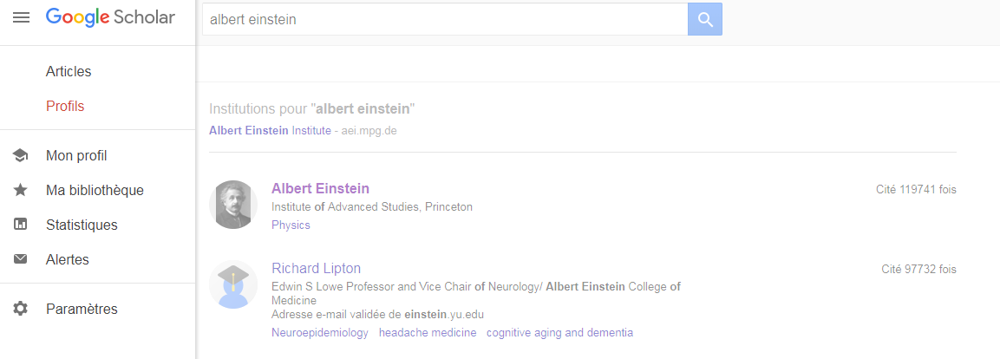
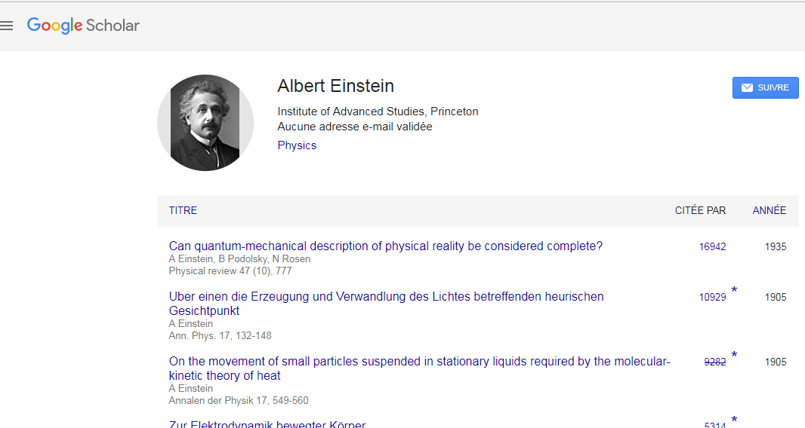
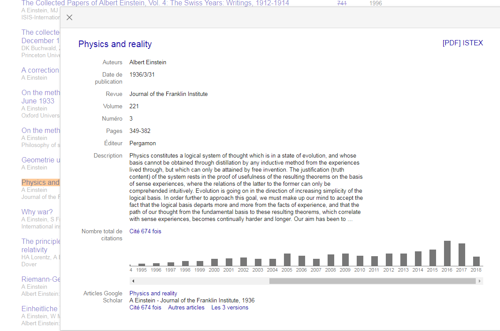
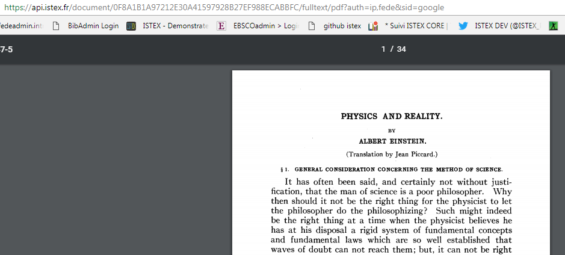

# Google Scholar

## OpenURL et diffusion d'ISTEX à travers Google Scholar

Comme pour tous les autres modes d’accès au PDF, il est limité aux ayants droit ISTEX, c'est-à-dire les personnels de l'Enseignement Supérieur et de la Recherche.

Il est possible au cours d'une recherche sur Google Scholar d'avoir accès via une OpenURL au pdf du document présent sur la plateforme ISTEX.

A chaque chargement d'un nouveau corpus sur la plateforme ISTEX un formulaire est adressé à Google Scholar pour leur demander l'activation des liens OpenURL pour les ressources présentes dans les fichiers Kbart disponibles sur le site le BACON en XML \(fournis par ABES\).

Google Scholar indique que l'activation \(et la mise à jour\) prend une à deux semaines.

## Paramètrage pour l'utilisateur

**Paramètrage à faire une seule fois**

* Aller sur Google Scholar
* Cliquer en haut à gauche pour voir les paramètrages

* Choisir "Paramètres"
* Puis "Liens vers des bibliothèques"

* Rechercher ISTEX
* Sélectionner
* Retourner à votre recherche

* \[PDF\]ISTEX signale un lien disponible

* Accèder au PDFdisponible sur la plateforme ISTEX

## Diffusion d'ISTEX à partir d'un article cité dans "Profils" d'auteur

 

* Recherche l’auteur « Albert Einstein »

* Puis sélectionner le menu à gauche , pour quitter le mode de recherche « Articles » et choisir le mode de recherche « Profils »

* Choisir l’Auteur souhaité

* Dérouler la liste des articles avec le nombre de citation et la date de publication

  

*  Sélectionner l’article de votre choix

  Par exemple : « Physics and reality » de 1936 cité 674 fois dont 21 fois en 2018 Le lien \[PDF\] ISTEX qui s’affiche permet d’accéder au PDF présent sur la plateforme ISTEX


Les liens OpenURL sont activés à partir des fichiers Kbart fournis à Google Scholar. Il peut y avoir une différence de couverture entre les fichiers Kbart et ce qui est réellement présent dans la plateforme ISTEX dans ce cas un message de non disponibilité s’affiche.


  

**Autre possibilité de paramétrage du lien vers la bibliothèque ISTEX** 

L'option de sélectionner le lien vers la bibliothèque ISTEX est proposée automatiquement au moment de l'installation du bouton ISTEX voir [**Bouton ISTEX**](bouton-istex.md)

