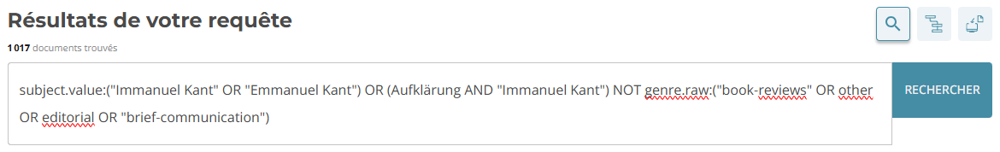
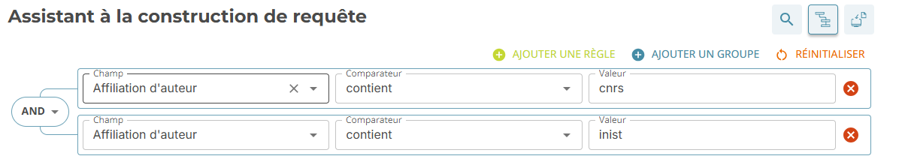
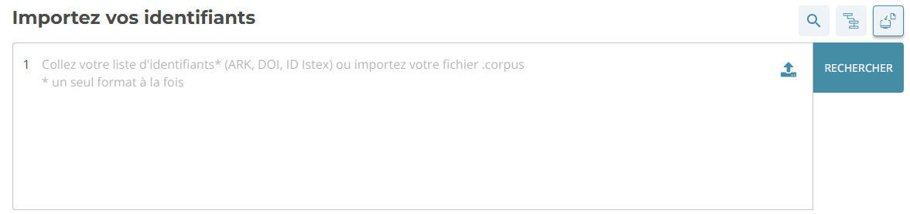
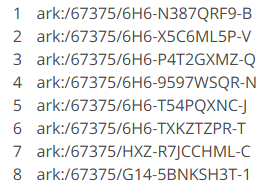

# Istex Search (en cours)

[Istex Search](https://search.istex.fr/fr-FR) est une service de l'infrastructure Istex dédié à la constitution de corpus. Son interface ergonomique connectée à l’API facilite la constitution de votre corpus en suivant trois étapes :

·         interrogation d'Istex

·         exploration des résultats

·         téléchargement de votre corpus

## Interrogation d'Istex

3 modes de recherche vous permettent d’interroger le réservoir Istex :

1. Recherche simple
2. Recherche assistée
3. Recherche par identifiants

### Recherche simple

Le mode de recherche simple interroge la base Istex en utilisant la syntaxe d’interrogation Lucene, le langage de requêtage du moteur de recherche Istex ([Elasticsearch](https://www.elastic.co/elasticsearch)), grâce à une équation avec les opérateurs booléens (ex. AND, OR).

Le mode de recherche simple est sélectionné par défaut à l’ouverture d’Istex Search.

<figure><figcaption></figcaption></figure>

### Recherche Assistée

Ce mode de recherche vous permet de construire une équation complexe sans connaissance a priori de la syntaxe Lucene, avec des règles et des groupes.

Une règle est constituée de trois informations : le champ que l’on souhaite interroger, le comparateur (égal à, contient etc.) et la valeur que l’on souhaite retrouver dans ce champ.

Les groupes sont l’équivalent de parenthèses. Comme en mathématiques, les opérations situées à l'intérieur des parenthèses ont la priorité.

<figure><figcaption></figcaption></figure>

### Recherche par identifiants

Ce mode de recherche utilise des identifiants uniques et pérennes attribués aux documents Istex (ARK, DOI ou idIstex). Il sélectionne les documents correspondant aux identifiants demandés s’ils sont présents dans le réservoir.

Il est notamment possible d’importer une liste d’identifiants mais avec un seul type d’identifiant à la fois.

<figure><figcaption></figcaption></figure>

<figure><figcaption></figcaption></figure>
