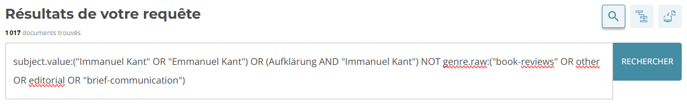
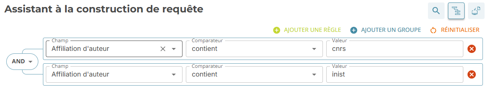
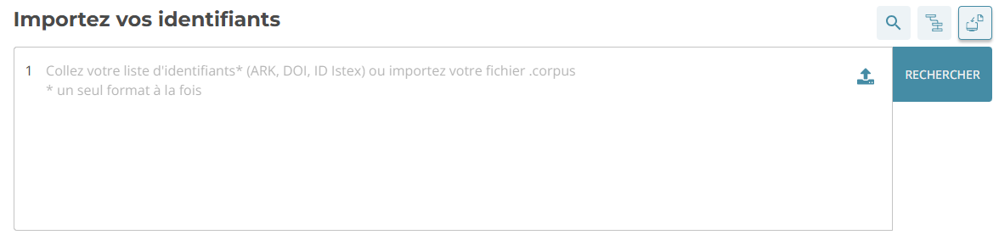
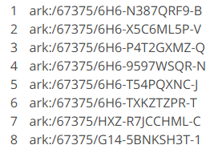
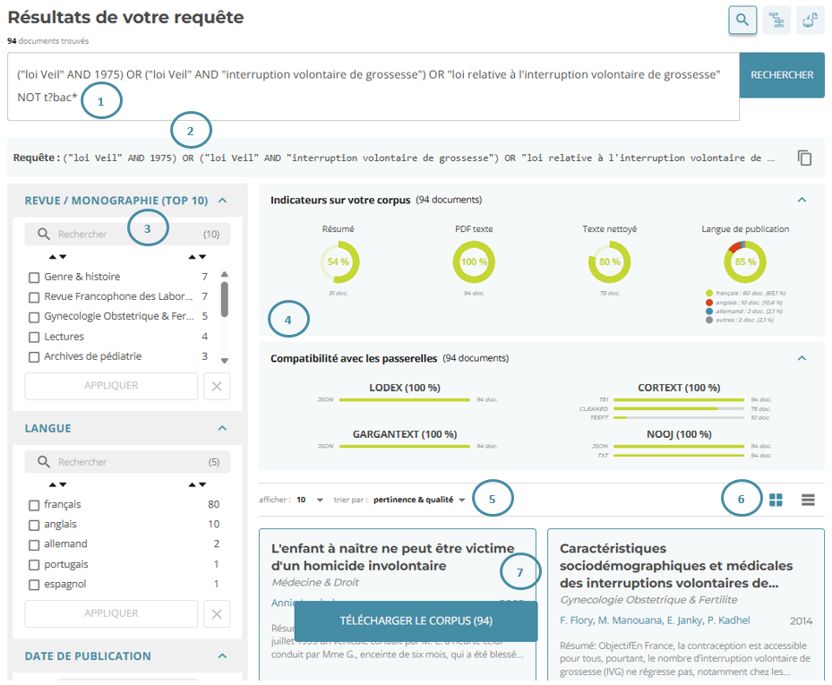
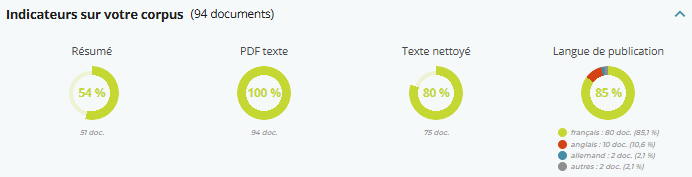
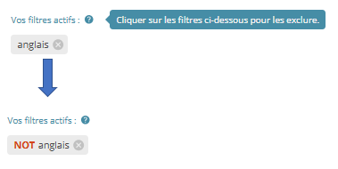
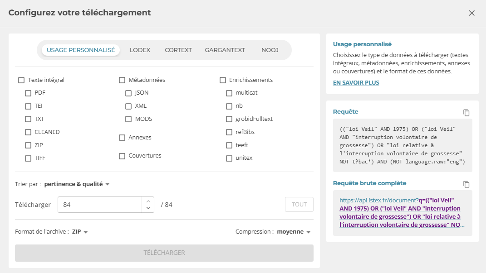

# Istex Search

[Istex Search](https://search.istex.fr/fr-FR) est une service de l'infrastructure Istex dédié à la constitution de corpus. Son interface ergonomique connectée à l’API facilite la constitution de votre corpus en suivant trois étapes :

·         interrogation d'Istex

·         exploration des résultats

·         téléchargement de votre corpus

## Interrogation d'Istex

3 modes de recherche vous permettent d’interroger le réservoir Istex :

1. Recherche simple
2. Recherche assistée
3. Recherche par identifiants

### Recherche simple

Le mode de recherche simple interroge la base Istex en utilisant la syntaxe d’interrogation Lucene, le langage de requêtage du moteur de recherche Istex ([Elasticsearch](https://www.elastic.co/elasticsearch)), grâce à une équation avec les opérateurs booléens (ex. AND, OR).

Le mode de recherche simple est sélectionné par défaut à l’ouverture d’Istex Search.

<figure><figcaption></figcaption></figure>

### Recherche Assistée

Ce mode de recherche vous permet de construire une équation complexe sans connaissance a priori de la syntaxe Lucene, avec des règles et des groupes.

Une règle est constituée de trois informations : le champ que l’on souhaite interroger, le comparateur (égal à, contient etc.) et la valeur que l’on souhaite retrouver dans ce champ.

Les groupes sont l’équivalent de parenthèses. Comme en mathématiques, les opérations situées à l'intérieur des parenthèses ont la priorité.

<figure><figcaption></figcaption></figure>

### **Liste des champs interrogeables dans Istex**

<table data-full-width="false"><thead><tr><th width="103" align="center">Champ (A-Z)</th><th width="113">Nom technique</th><th width="90">Description</th><th width="240">Exemple de requête</th></tr></thead><tbody><tr><td align="center">Affiliation d'auteur</td><td>author.affiliations</td><td>Recherche par l'affiliation d'un auteur</td><td>author.affiliations:CNRS</td></tr><tr><td align="center">Affiliation d'auteur d'une monographie</td><td>host.author.affiliations</td><td>Recherche par l'affiliation d'un auteur d'une monographie</td><td>host.author.affiliations:CNRS</td></tr><tr><td align="center">ARK</td><td>arkIstex</td><td>Recherche par l'ARK du document</td><td>arkIstex:"ark:/67375/G14-1RDSJMLS-D"</td></tr><tr><td align="center">Bouquet</td><td>corpusName</td><td>Recherche par bouquet éditeur chargé dans Istex</td><td>corpusName:"degruyter-ebooks-french"</td></tr><tr><td align="center">Catégorie Inist</td><td>categories.inist</td><td>Recherche par un domaine scientifique de la classification Pascal et Francis</td><td>categories.inist:linguistique</td></tr><tr><td align="center">Catégorie Science-Metrix</td><td>categories.scienceMetrix</td><td>Recherche par un domaine scientifique de la classification Science-Metrix</td><td>categories.scienceMetrix:"2 - agriculture, fisheries &#x26; forestry"</td></tr><tr><td align="center">Catégorie Scopus</td><td>categories.scopus</td><td>Recherche par un domaine scientifique de la classification Scopus</td><td>categories.scopus:medicine</td></tr><tr><td align="center">Catégorie WoS</td><td>categories.wos</td><td>Recherche par un domaine scientifique de la classification Web of Science</td><td>categories.wos:zoology</td></tr><tr><td align="center">Contenu de légende</td><td>figure</td><td>Recherche dans le contenu des légendes</td><td>figure:photographie</td></tr><tr><td align="center">Contenu des tableaux</td><td>table</td><td>Recherche dans le contenu des tableaux</td><td>table:"Alzheimer’s Disease"</td></tr><tr><td align="center">Date de publication</td><td>publicationDate</td><td>Recherche par date de publication</td><td>publicationDate:2024</td></tr><tr><td align="center">Date de publication d'un document référencé</td><td>refBibs.publicationDate</td><td>Recherche par la date de publication d'une référence bibliographique</td><td>refBibs.publicationDate:1995</td></tr><tr><td align="center">DOI de la revue</td><td>host.doi</td><td>Recherche par le DOI de la revue</td><td>host.doi:"10.1484/M.STT-EB.6.09070802050003050306060802"</td></tr><tr><td align="center">DOI de la série</td><td>serie.doi</td><td>Recherche par le DOI de la série de monographies</td><td>serie.doi:"10.1484/STT-EB"</td></tr><tr><td align="center">DOI du document</td><td>doi</td><td>Recherche par le DOI du document</td><td>doi:"10.1016/j.evopsy.2008.01.005"</td></tr><tr><td align="center">DOI d'un document référencé</td><td>refBibs.doi</td><td>Recherche par le DOI d'une référence bibliographique</td><td>refBibs.doi:"doi:10.1111/j.1751-5823.2010.00112.x"</td></tr><tr><td align="center">e-ISBN de la monographie</td><td>host.eisbn</td><td>Recherche par le numéro ISBN de la monographie électronique</td><td>host.eisbn:"978-2-503-54195-2"</td></tr><tr><td align="center">e-ISSN de la revue</td><td>host.eissn</td><td>Recherche par le numéro ISSN de la revue électronique</td><td>host.eissn:"2053-9207"</td></tr><tr><td align="center">e-ISSN de la série</td><td>serie.eissn</td><td>Recherche par le numéro ISSN de la série de monographies électroniques</td><td>serie.eissn:"2192-8541"</td></tr><tr><td align="center">Formule</td><td>hasFormula</td><td>Recherche la présence d'une formule mathématique</td><td>hasFormula:true</td></tr><tr><td align="center">ISBN de la monographie</td><td>host.isbn</td><td>Recherche par le numéro ISBN de la monographie papier</td><td>host.isbn:"978-3-031-19699-7"</td></tr><tr><td align="center">ISSN de la revue</td><td>host.issn</td><td>Recherche par le numéro ISSN de la revue papier</td><td>host.issn:"0378-5548"</td></tr><tr><td align="center">ISSN de la série</td><td>serie.issn</td><td>Recherche par le numéro ISSN de la série de monographies papiers</td><td>serie.issn:"0013-0559"</td></tr><tr><td align="center">Langue</td><td>language</td><td>Recherche selon la langue du document</td><td>language:fre</td></tr><tr><td align="center">Langue de publication de la revue ou de la monographie</td><td>host.language</td><td>Recherche selon la langue de publication de la revue ou de la monographie</td><td>host.language:eng</td></tr><tr><td align="center">Langue des mots-clés d'auteur</td><td>subject.lang</td><td>Recherche selon la langue des mots-clés d'auteurs</td><td>subject.lang:dut</td></tr><tr><td align="center">Libre accès</td><td>accessCondition.contentType</td><td>Recherche de documents selon leur accessibilité</td><td>accessCondition.contentType:isOpenAccess</td></tr><tr><td align="center">Mot-clé d'auteur</td><td>subject.value</td><td>Recherche par l'un des mots-clés d'auteurs</td><td>subject.value:beer</td></tr><tr><td align="center">Mot-clé de la revue</td><td>host.subject.value</td><td>Recherche par l'un des mots-clés attribués à la revue</td><td>host.subject.value:engineering</td></tr><tr><td align="center">Mot-clé teeft</td><td>keywords.teeft</td><td>Recherche par l'un des mots-clés extraits par Teeft (Terms Extraction for English Full Texts)</td><td>keywords.teeft:semiologie</td></tr><tr><td align="center">Nom d'auteur</td><td>author.name</td><td>Recherche par le nom d'un auteur</td><td>author.name:"Laurent Schwartz"</td></tr><tr><td align="center">Nom d'auteur d'un document référencé</td><td>refBibs.author.name</td><td>Recherche par le nom d'un auteur d'une référence bibliographique de type article ou chapitre</td><td>refBibs.author.name:"Pierre Bourdieu"</td></tr><tr><td align="center">Nom d'auteur d'une monographie</td><td>host.author.name</td><td>Recherche par le nom d'un auteur d'une monographie</td><td>host.author.name:"Michel Cartry"</td></tr><tr><td align="center">Nom d'auteur d'une monographie référencée</td><td>refBibs.host.author.name</td><td>Recherche par le nom d'un auteur d'une référence bibliographique de type monographie</td><td>refBibs.host.author.name:"Émile Durkheim"</td></tr><tr><td align="center">Nom de la conférence (revue ou monographie)</td><td>host.conference.name</td><td>Recherche par le nom de la conférence (actes publiés sous la forme d'une revue ou monographie)</td><td>host.conference.name:"Titan Through Time: A Workshop on Titans Formation"</td></tr><tr><td align="center">Nom de la conférence (série)</td><td>serie.conference.name</td><td>Recherche par le nom de la conférence (actes publiés sous la forme d'une série)</td><td>serie.conference.name:"Proceedings of the 4th Workshop on Logical and Semantic Frameworks, with Applications"</td></tr><tr><td align="center">Nom de lieu administratif</td><td>namedEntities.unitex.placeName</td><td>Recherche par entité nommée de type "nom de lieu géopolitique ou administratif" détectée par Unitex</td><td>namedEntities.unitex.placeName:Hawaï</td></tr><tr><td align="center">Nom de lieu géographique</td><td>namedEntities.unitex.geogName</td><td>Recherche par entité nommée de type "nom de lieu" détectée par Unitex</td><td>namedEntities.unitex.geogName:Salonga</td></tr><tr><td align="center">Nom de personne</td><td>namedEntities.unitex.persName</td><td>Recherche par entité nommée de type "nom de personne" détectée par Unitex</td><td>namedEntities.unitex.persName:"Olympe de Gouges"</td></tr><tr><td align="center">Nom d'organisation</td><td>namedEntities.unitex.orgName</td><td>Recherche par entité nommée de type "nom d'organisation" détectée par Unitex</td><td>namedEntities.unitex.orgName:WWF</td></tr><tr><td align="center">Nom d'organisme financeur</td><td>namedEntities.unitex.orgName_funder</td><td>Recherche par entité nommée de type "organisme financeur" détectée par Unitex</td><td>namedEntities.unitex.orgName_funder:"University of Freiburg"</td></tr><tr><td align="center">Nom exprimant une date</td><td>namedEntities.unitex.date</td><td>Recherche par entité nommée de type "date, période, siècle" détectée par Unitex</td><td>namedEntities.unitex.date:1515</td></tr><tr><td align="center">Nombre de caractères du PDF</td><td>qualityIndicators.pdfCharCount</td><td>Recherche selon le nombre de caractères du document PDF</td><td>qualityIndicators.pdfCharCount:&#x3C;15000</td></tr><tr><td align="center">Nombre de caractères du résumé</td><td>qualityIndicators.abstractCharCount</td><td>Recherche selon le nombre de caractères du résumé</td><td>qualityIndicators.abstractCharCount:>50</td></tr><tr><td align="center">Nombre de mots du PDF</td><td>qualityIndicators.pdfWordCount</td><td>Recherche selon le nombre de mots dans le document PDF</td><td>qualityIndicators.pdfWordCount:[1000 TO 10000]</td></tr><tr><td align="center">Nombre de mots du résumé</td><td>qualityIndicators.abstractWordCount</td><td>Recherche selon le nombre de mots du résumé</td><td>qualityIndicators.abstractWordCount:[500 TO 1000]</td></tr><tr><td align="center">Nombre de mots par page du PDF</td><td>qualityIndicators.pdfWordsPerPage</td><td>Recherche selon le nombre de mots par page dans le document PDF</td><td>qualityIndicators.pdfWordsPerPage:1000</td></tr><tr><td align="center">Nombre de pages du PDF</td><td>qualityIndicators.pdfPageCount</td><td>Recherche selon le nombre de pages du document PDF</td><td>qualityIndicators.pdfPageCount:[10 TO 20]</td></tr><tr><td align="center">Numéro de la revue ou de la monographie</td><td>host.issue</td><td>Recherche par le numéro de la revue ou de la monographie</td><td>host.issue:4</td></tr><tr><td align="center">Numéro de la série</td><td>serie.issue</td><td>Recherche par le numéro de la série de monographies</td><td>serie.issue:12</td></tr><tr><td align="center">PDF textuel</td><td>qualityIndicators.pdfText</td><td>Recherche de documents au format PDF qui contiennent du texte</td><td>qualityIndicators.pdfText:true</td></tr><tr><td align="center">Références bibliographiques</td><td>qualityIndicators.refBibsNative</td><td>Recherche selon la présence de références bibliographiques natives</td><td>qualityIndicators.refBibsNative:false</td></tr><tr><td align="center">Résumé</td><td>abstract</td><td>Recherche dans le résumé</td><td>abstract:(translation AND "machine learning")</td></tr><tr><td align="center">Score</td><td>qualityIndicators.score</td><td>Recherche selon le score de qualité du document</td><td>qualityIndicators.score:>7</td></tr><tr><td align="center">Source TEI</td><td>qualityIndicators.teiSource</td><td>Recherche selon la provenance du document TEI</td><td>qualityIndicators.teiSource:grobid</td></tr><tr><td align="center">Texte intégral</td><td>fulltext</td><td>Recherche dans le texte intégral (corps du texte et métadonnées)</td><td>fulltext:"alien invasive species"</td></tr><tr><td align="center">Titre</td><td>title</td><td>Recherche dans le titre</td><td>title:"Les droits de l’homme de la femme: polysémie ou androcentrisme?"</td></tr><tr><td align="center">Titre de la revue ou de la monographie</td><td>host.title</td><td>Recherche dans le titre de la revue ou de la monographie</td><td>host.title:"mineralogia"</td></tr><tr><td align="center">Titre de la série</td><td>serie.title</td><td>Recherche dans le titre de la série de monographies</td><td>serie.title:"Moyen Âge"</td></tr><tr><td align="center">Titre de revue d'un document référencé</td><td>refBibs.host.title</td><td>Recherche par le titre de revue d'une référence bibliographique</td><td>refBibs.host.title:lingua</td></tr><tr><td align="center">Titre de série d'une référence bibliographique</td><td>refBibs.serie.title</td><td>Recherche par le titre de la série d'une référence bibliographique</td><td>refBibs.serie.title:"The peptides"</td></tr><tr><td align="center">Titre d'une référence bibliographique</td><td>refBibs.title</td><td>Recherche par le titre d'une référence bibliographique</td><td>refBibs.title:"Topology of cosmic domains and strings"</td></tr><tr><td align="center">TXT compatible TDM</td><td>qualityIndicators.tdmReady</td><td>Recherche de documents au format TXT exploitables dans un outil de fouille de textes</td><td>qualityIndicators.tdmReady:true</td></tr><tr><td align="center">Type de contenu</td><td>genre</td><td>Recherche selon le type du document</td><td>genre:article</td></tr><tr><td align="center">Type de libre accès</td><td>accessCondition.value</td><td>Recherche de documents par type de libre accès</td><td>accessCondition.value:greenOpenAccess</td></tr><tr><td align="center">Type de publication</td><td>host.genre</td><td>Rercheche selon le type de publication</td><td>host.genre:"book-series"</td></tr><tr><td align="center">Type d'enrichissement</td><td>enrichments.type</td><td>Recherche de documents comportant un enrichissement</td><td>enrichments.type:"grobidFulltext"</td></tr><tr><td align="center">URL</td><td>namedEntities.unitex.ref_url</td><td>Recherche par entité nommée de type "URL" détectée par Unitex</td><td>namedEntities.unitex.ref_url:arxiv.org</td></tr><tr><td align="center">Version du PDF</td><td>qualityIndicators.pdfVersion</td><td>Recherche selon la version du format PDF du document</td><td>qualityIndicators.pdfVersion:1.4</td></tr><tr><td align="center">Volume de la revue ou monographie</td><td>host.volume</td><td>Recherche par le volume de la revue ou de la monographie</td><td>host.volume:12</td></tr><tr><td align="center">Volume de revue d'un document référencé</td><td>refBibs.host.volume</td><td>Recherche par le numéro de volume d'une référence bibliographique</td><td>refBibs.host.volume:4</td></tr></tbody></table>

### Recherche par identifiants

Ce mode de recherche utilise des identifiants uniques et pérennes attribués aux documents Istex (ARK, DOI ou idIstex). Il sélectionne les documents correspondant aux identifiants demandés s’ils sont présents dans le réservoir.

Il est notamment possible d’importer une liste d’identifiants mais avec un seul type d’identifiant à la fois.

<figure><figcaption></figcaption></figure>

<figure><figcaption></figcaption></figure>

## Exploration des résultats

Différents filtres et indicateurs permettent d'analyser le contenu le corpus et d'affiner la requête pour obtenir un corpus de qualité.

Quand la recherche est lancée, une page _Résultats de votre requête_ propose une vision d’ensemble du corpus et d’affiner celui-ci si nécessaire.

<figure><figcaption></figcaption></figure>

* Nombre de documents correspondant à la requête en cours (1)
* Requête envoyée à l’API Istex, elle peut être copiée dans le presse-papier en cliquant sur le bouton copier-coller  en bout de ligne (2)
* Filtres permettant d'explorer et d'affiner le corpus (3)
* Indicateurs scientifiques et techniques sur le corpus et pourcentage de compatibilité entre le corpus et des outils d’analyse (4)
* Modes de tri des documents du corpus (5)
* Affichage en colonne ou ligne (6)
* Vignettes cliquables correspondant aux documents du corpus (7)

### Indicateurs

Les indicateurs permettent de vérifier rapidement le pourcentage et le nombre de documents possédant un Résumé, un PDF texte, un format Texte nettoyé (format CLEANED), ainsi que la part des trois Langues de publication majoritaires dans le corpus.

<figure><figcaption></figcaption></figure>

### Filtres

La page de résultats comporte 11 filtres pour explorer les résultats ou restreindre la recherche.

<figure><figcaption></figcaption></figure>

Pour **appliquer un filtre**, il faut cocher ou rechercher la valeur souhaitée puis cliquer sur APPLIQUER. Le nombre de documents du corpus est ainsi mis à jour.

Il est possible d'obtenir l'inverse d'un filtre en cliquant sur le tag du filtre :

<figure><figcaption></figcaption></figure>

### Modes de tri

Quatre modes de tri sont proposés :

1. _pertinence et qualité_ : classe les documents selon un ordre de pertinence associé à un score de qualité ;
2. _aléatoire_ : classe les documents de façon aléatoire, eut être utile pour analyser un échantillon de documents parmi les résultats obtenus ;
3. _date de publication_ : classe les publications selon leur date de publication (croissante ou décroissante) ;
4. _titre_ : permet de classer les publications par ordre alphabétique ou antialphabétique.

## Téléchargement d'un corpus

Istex Search permet de télécharger **jusqu'à 100 000 documents en une seule fois** et propose plusieurs formats de téléchargement.

Pour télécharger un corpus, il faut cliquer sur _TELECHARGER LE CORPUS_ dans l'encadré bleu :

<figure><figcaption></figcaption></figure>

Une fenêtre apparaît et propose de sélectionner les types de fichiers et de formats à extraire, adaptés à l’utilisation qui va être faite du corpus :

<figure><figcaption></figcaption></figure>

1. usage personnalisé pour sélectionner "à la carte" les fichiers et formats
2. usages prédéfinis:
   * Lodex > sélection automatique des métadonnées au format JSON ;
   * CorTexT > sélection automatique des textes intégraux aux formats TEI et CLEANED et des enrichissements _Teeft_ au format TEI ;
   * GarganText > sélection automatique des métadonnées au format JSON, seule sélection compatible avec le logiciel
   * NooJ > sélection automatique des textes intégraux au format TXT et des métadonnées au format JSON, seule sélection compatible avec le logiciel

