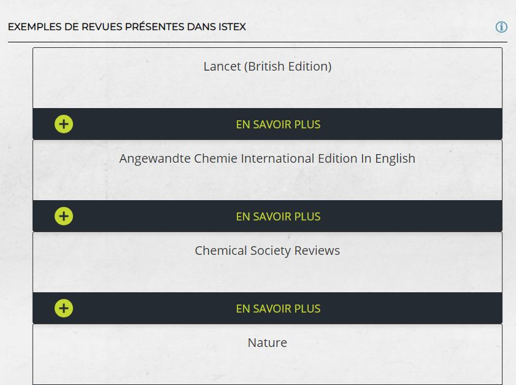
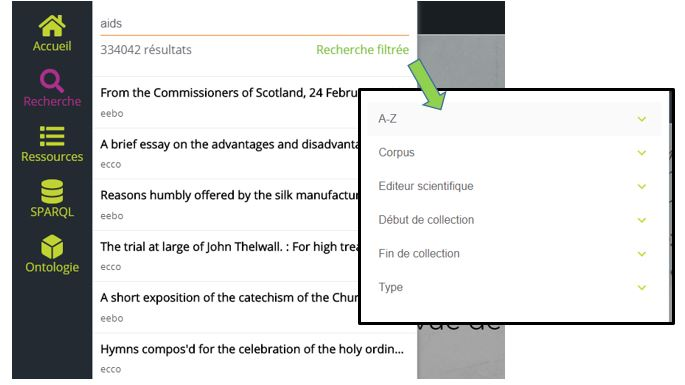
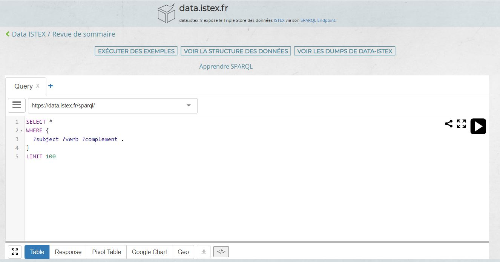
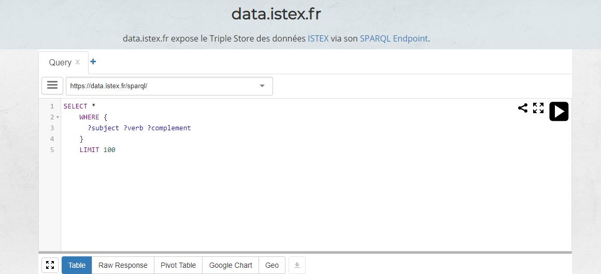
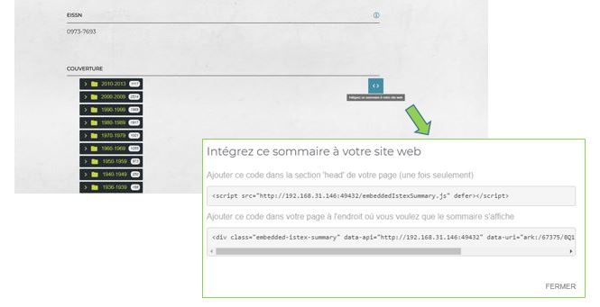

# Revue de sommaire

La  ****[Revue de sommaire](https://revue-sommaire.data.istex.fr%20%20) a pour but de :

* proposer des pages dédiées pour chaque revue ISTEX en présentant un accès par année - volume - numéro -titre du document, jusqu'à l'accès au plein texte disponible sur la plateforme ISTEX
* proposer aux établissements une vision revue de sommaire pour les titres présents dans la plateforme ISTEX intégrable dans leur portail documentaire
* présenter un réel état de collection des ressources présentes sur la plateforme ISTEX

L'instance _revue de sommaire ISTEX_  propose un nouveau jeu de données présent dans le site  [https://data.istex.fr](https://data.istex.fr). Le site data.istex.fr expose des données [ISTEX](http://www.istex.fr/), selon les normes du web sémantique, dans un Triple Store via son [SPARQL Endpoint](http://data.istex.fr/triplestore/sparql).

## Interface

###   Accueil  

1- Une répartition graphique des ressources par corpus

En cliquant sur la flèche verte vous pouvez naviguer dans les résultats, rechercher, filtrer.


Pour rendre le graphique plus lisible, les très gros corpus, ECCO et EEBO, sont masqués, mais vous les retrouvez au moment de la navigation.


Par exemple, pour une recherche des ressources avec le mot _"physical"_

2-  Des exemples de revues présentes dans ISTEX

Des revues incontournables sont mises en avant pour introduire la plateforme. 

###    Recherche

* il suffit d'écrire un mot ou un titre dans l'écran de recherche

* pour affiner et aider à la recherche, une recherche filtrée est proposée par _A-Z_, _corpus_ \(ressources négociées\), _éditeur scientifique_ \(le nom peut être différent de celui du corpus\), _début de collection_ \(données ABES\), _fin de collection_ \(données ABES\), _type_ \(monographie, série\).

###  Ressources

 Cette page affiche le nombre total de ressources chargées

1.  __il est possible de faire une recherche par titre ou par mot du titre
2.  de filtrer les résultats
3. de trier en cliquant en haut des colonne
4. de changer le nombre d'affichage des ressources
5. d'exporter les titres des ressources selon divers format

###   SPARQL

Pour utiliser le SPARQL EndPoint ISTEX et/ou  comparer vos ressources avec les ressources présentes dans ISTEX.


Pour afficher cet écran, n'hésitez pas à re cliquer si besoin.


###   Ontologie 

Sont disponibles sur cette page toutes les informations de l'ontologie du projet ISTEX qui définit 13 Classes, 11 Object Properties et 13 Data Properties.  Accès libre sur[ GITHUB](https://github.com/istex/ontology/blob/master/istexXML.owl) .

## **Résultats**

### **Recherche d'une ressource**

La recherche peut se faire sur la page _Recherche_ ou _Ressources_.

* par défaut l'opérateur booléen est un            =&gt;  `pediatric journal = 5763`
* par défaut un caractère wildcare est présent =&gt;  `pediatric journal = 5763`
* pour avoir un AND entre 2 termes mettre des "  " =&gt; `"pediatrics" "journal" = 8`
* dans ce cas pas de caractère wildcare =&gt;`"pediatric" "journal" = 25` 
* la recherche par filtre remplace la recherche avancée 

### Revue de sommaire

En sélectionnant le titre de la ressource souhaitée une page s'ouvre :

1. titre de la ressource
2. information sur le corpus : lien vers le référentiel des corpus chargés dans ISTEX   [https://loaded-corpus.data.istex.fr](https://loaded-corpus.data.istex.fr) et nom du corpus , lors de la négociation nationale
3. éditeur scientifique : le nom peut être différent que celui du corpus
4. issn/eissn           isbn/eisbn
5. couverture : de la ressource jusqu'au document \(article, chapitre\) requête à l'API ISTEX
6. alignement Wikidata : à l'aide d'une requête SPARQL, les informations sont partagées
7.  ark de la revue \(en [savoir plus](https://blog.istex.fr/des-ark-dans-istex/)\)
8. ajouter un champ permet à tous des suggestions
9. partager/exporter : nombreux formats disponibles : N-Quads, CSV, Turtle, JSON...

 


La liste des titres dans _Revue de sommaire ISTEX_ correspond à la liste contractuelle des [licences nationales](https://www.licencesnationales.fr/liste-ressources/) pour les corpus chargés sur la plateforme ISTEX

La couverture affichée pour une ressource correspond aux documents présents sur la plateforme ISTEX

Il peut y avoir une différence entre les deux  


###  Intégrer le sommaire dans un site web

* copier le code de la ressource disponible dans le champ couverture

* coller le tout dans une page html

\`\`

\*\*\*\*

\*\*\*\*

\*\*\*\*

