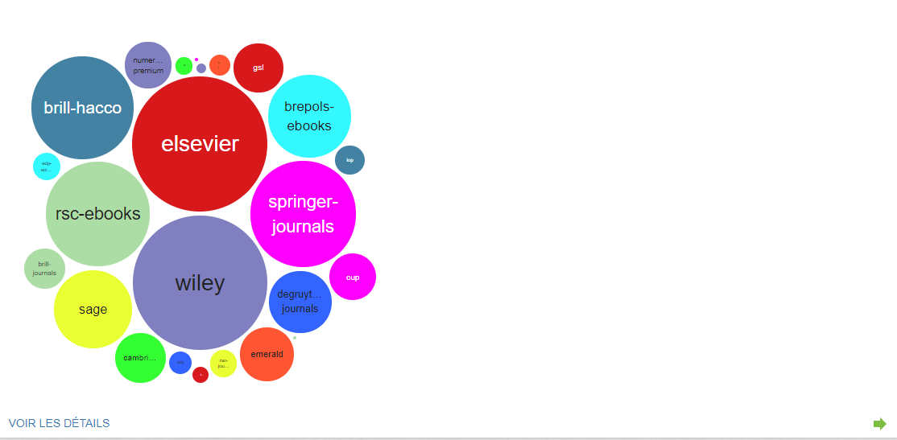
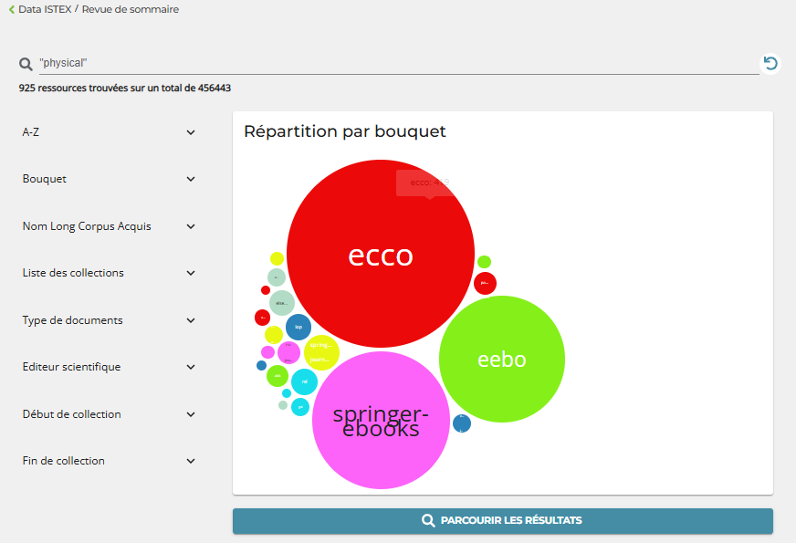
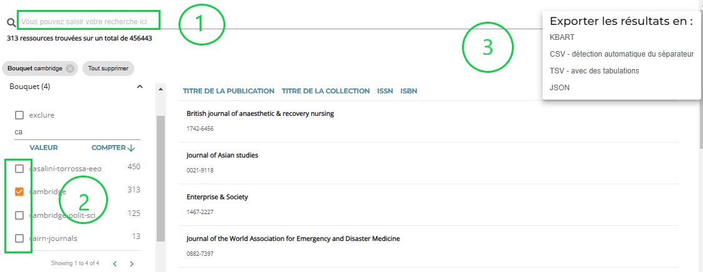
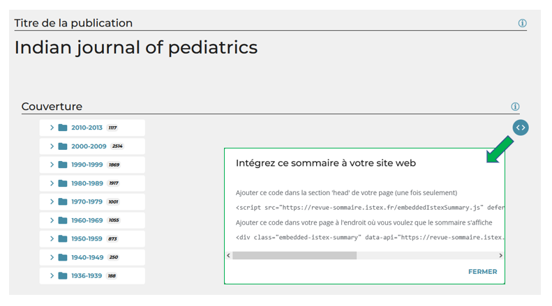
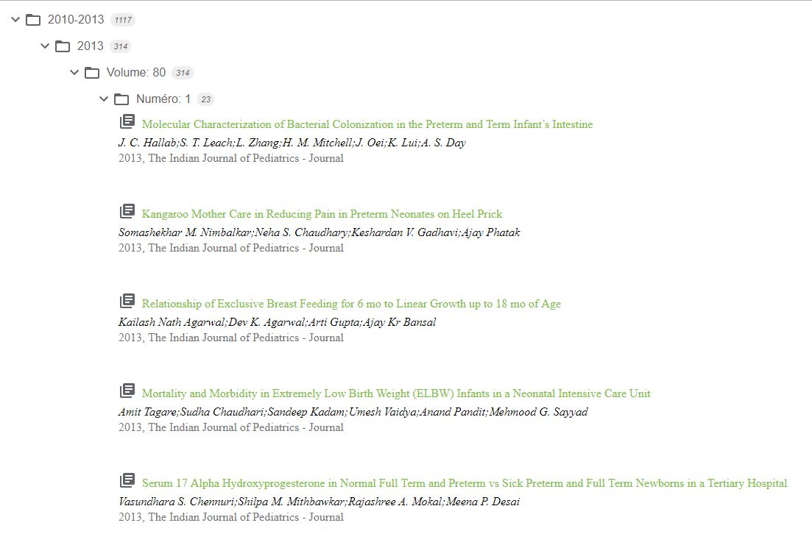

# Revue de sommaire

<figure><figcaption></figcaption></figure>

La _Revue de sommaire_ a pour but de :

* proposer des pages **dédiées pour chaque revue Istex** en présentant un accès par année - volume - numéro - titre du document, jusqu'à l'accès au plein texte disponible sur la plateforme Istex
* proposer aux établissements **une vision "revue de sommaire"**, pour les titres présents dans la plateforme Istex, intégrable dans leur portail documentaire
* proposer une liste de titres dont les **articles citent l’ouvrage/la revue** recherchés
* afficher **la liste contractuelle des titres** des licences nationales pour les corpus chargés sur la plateforme Istex
* présenter **un réel état de collection** des ressources présentes sur la plateforme Istex
* &#x20;proposer un **export au format KBART-Istex,** des ressources et de l’état de collection disponible dans la plateforme Istex
  * Un fichier KBART-Istex global, avec mise à jour automatique, est disponible en page d'accueil&#x20;
  * Un fichier KBART-Istex par corpus, année... est à exporter au niveau de la page recherche

&#x20;&#x20;

<figure><figcaption></figcaption></figure>


* Les titres présents, dans la "Revue de Sommaire"_,_ proviennent du fichier de **KBART-Abes de référence**
* La création d'un export **KBART-Istex** permet de mettre à disposition des utilisateurs des tableaux KBART qui reflètent **la couverture réelle d'Istex, il peut donc y avoir plusieurs lignes par titre pour mettre en avant les trous dans les collections.**


L'instance [_Revue de sommaire Istex_](https://revue-sommaire.istex.fr/)  est disponible sur le site [https://data.istex.fr](https://data.istex.fr). 

## Interface

### Accueil

1- Une répartition graphique des ressources par corpus

En cliquant sur la flèche verte, ou sur "voir les détails", vous pouvez naviguer dans les résultats, rechercher, filtrer.


Pour rendre le graphique plus lisible, les très gros corpus ECCO et EEBO, sont masqués, mais vous les retrouvez au moment de la navigation.


Par exemple, pour rechercher des ressources avec le mot _"physical"_

<figure><figcaption></figcaption></figure>

2- Des exemples de revues présentes dans Istex

Des revues incontournables sont mises en avant pour introduire la plateforme.

<figure><figcaption></figcaption></figure>

### Recherche

* il suffit d'écrire un mot ou un titre dans l'écran de recherche (1)

<figure><figcaption></figcaption></figure>

* pour affiner et aider à la recherche, une recherche filtrée (2) est proposée par _A-Z_, _bouquet_ (ressources négociées), _éditeur scientifique_ (le nom peut être différent de celui du corpus), _début de collection_ (données Abes), _fin de collection_ (données Abes), _type_ (monographie, série).
* Le résultat de votre recherche peut-être exporté dans différents formats (3) : CSV, TSV, KBART-Istex....

## **Résultats**

### **Recherche d'une ressource**

La recherche peut se faire sur la page _Recherche_ ou _Ressources_.

* par défaut l'opérateur booléen est un OR =>  `pediatric journal = 5763`
* par défaut un métacaractère est présent =>  `pediatrics journal = 5763`
* pour avoir un AND entre 2 termes mettre des "  " => `"pediatrics" "journal" = 8`
* dans ce cas pas de métacaractère =>`"pediatric" "journal" = 25`&#x20;
* la recherche par filtre remplace la recherche avancée&#x20;

### Revue de sommaire

En sélectionnant le titre de la ressource souhaitée une page s'ouvre :&#x20;

<figure><figcaption></figcaption></figure>

* titre de la ressource (1)
* couverture de la ressource jusqu'au document (article, chapitre) requête à l'API Istex (2)
* accès aux articles qui ont été le plus cités pour cette revue (3)
* accès à un panel des 10 revues les plus pertinentes citant les articles de la revue recherchée, possibilité de télécharger leurs citations dans [Istex Search](https://search.istex.fr/) (4)

<figure><figcaption></figcaption></figure>

* information sur le bouquet, lien vers le [référentiel des bouquets chargés](https://loaded-corpus.data.istex.fr/) dans Istex (5)
* nom du bouquet lors de la négociation nationale (6)
* éditeur scientifique d'origine (7)
* issn/eissn  ou  isbn/eisbn (8)
* PPN : identifiant pérenne de la notice de la revue dans le SUDOC (9)
* alignement avec Wikidata, à l'aide d'une requête SPARQL (10)
* exporter, de nombreux formats disponibles :  CSV, TSV, KBART, JSON... (11)


* La liste des titres dans _Revue de sommaire Istex_ correspond à la liste contractuelle des [licences nationales](https://www.licencesnationales.fr/liste-ressources/) pour les corpus chargés sur la plateforme Istex
* La couverture affichée pour une ressource correspond aux documents présents sur la plateforme Istex

&#x20;Il peut y avoir une différence entre les deux.



### Intégrer le sommaire dans un site web

* copier le code de la ressource disponible dans le champ couverture

<figure><figcaption></figcaption></figure>

* coller le tout dans une page html

Il ne reste plus qu'à appliquer votre propre css (feuille de style de votre site).
