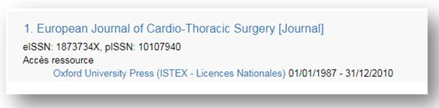
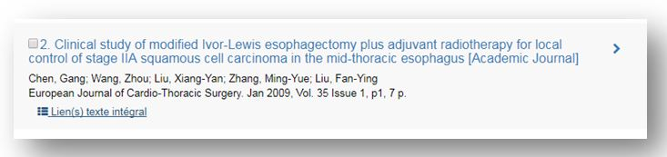
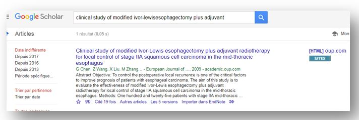

# A quoi sert ISTEX ?

**Quel est l'apport de ce service par rapport à BiblioInserm, BibCnrs, NCBI ou PubMed ?**

C’est tout à fait normal de se poser ce genre de questions car pour beaucoup d’utilisateurs, ISTEX c’est uniquement des archives en licences nationales avec accès sur la plateforme de l'éditeur via un portail institutionnel \(BibCnrs, BiblioInserm, lien ressources portail &lt;=&gt; PubMed....\)

Mais Le projet [**ISTEX**](https://www.istex.fr/) a pour vocation :

**1\) D’offrir à l’ensemble de la communauté de l’ESR, un accès en ligne aux collections rétrospectives de la littérature scientifique dans toutes les disciplines, en engageant une politique nationale d’acquisition massive de documentation** C'est l'utilisation documentaire quotidienne et transparente à partir d'une interface.

Voici quelques exemples d'intégrations permettant l'accès documentaire aux ressources ISTEX :

**Recherche par titre de périodique**

Exemple : les archives de la revue **Europeen Journal of Cardio-Thoracic Surgery** \(1987- 2010\) achetées dans le cadre du projet ISTEX

**Recherche par article**

“Clinical study of modified Ivor-Lewis esophagectomy plus adjuvant radiotherapy for local control of stage IIA squamous cell carcinoma in the mid-thoracic esophagus" article de 2009

=&gt; Via votre Portail

* Le 1er accès du pdf se fait directement sur la plateforme ISTEX
* Le 2ème accès qui est le même est consultable sur la plateforme éditeur, car l'accès éditeur et pour l'instant toujours disponible

=&gt; Via NCBI - PubMed

L'accès au texte intégral se fait en cliquant sur le logo du portail directement à partir de la notice bibliographique

=&gt; Via Google Scholar

En déchargeant [l’extension disponible pour chrome et firefox](https://addons.istex.fr/) l'icône ISTEX permet d’accéder directement au PDF de l’article présent sur la plateforme ISTEX.

**2\) De développer une plateforme d’exploitation de ces ressources en proposant des services uniques à valeur ajoutée , notamment de fouille de textes et de contenus.** C'est l'interrogation par API de la plateforme ISTEX.

Le deuxième point concerne les personnes qui souhaitent interroger directement la plateforme ISTEX et ses ressources pour un usage d’extraction de données, fouille de textes, production de synthèses documentaires et de corpus terminologiques, en ne passant pas par un portail documentaire.

L’équation d'interrogation peut se préparer directement depuis le navigateur et [les tutoriaux](http://www.inist.fr/?Tutoriels-Interrogation-de-l-API&lang=fr) sont utiles pour acquérir les connaissances nécessaires. La [documentation technique de l'API](https://api.istex.fr/documentation/) est également une bonne source d'information.

Le profil des utilisateurs est alors plus informaticien que documentaire.

