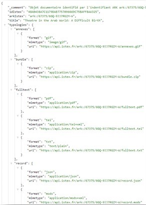

# Mais pourquoi mettre un ARK ?

**=> Lorsque vous recherchez le PDF d'un article**

_« Theatre in the Arab World: A Difficult Birth »_ l'URL se construit ainsi[\
](https://api.istex.fr/document/48AB438A7C1179DAB7757096669C75BAFF8AA325/fulltext/pdf?sid=clickandread)[https://api.istex.fr/document/48AB438A7C1179DAB7757096669C75BAFF8AA325/fulltext/pdf?sid=clickandread](https://api.istex.fr/document/48AB438A7C1179DAB7757096669C75BAFF8AA325/fulltext/pdf?sid=clickandread)

* URL de la plateforme
* Document/ numéro Istex /
* Format du document
* Le sid qui caractérise la voie d’accès

**=> Mais toutes les notices ont également un identifiant pérenne ARK (Archival Resource Key)**

Sachant que les 2 types d’accès au document perdureront.

_« Theatre in the Arab World: A Difficult Birth »_ qui provient de “Cambridge” l’accès au document se fait maintenant, également, avec cette url :

[https://api.istex.fr/ark:/67375/6GQ-9JJ7RGZM-W/fulltext.pdf?sid=clickandread](https://api.istex.fr/ark:/67375/6GQ-9JJ7RGZM-W/fulltext.pdf?sid=clickandread)

**=> L’intérêt, aujourd’hui, c’est de pointer directement sur un format grâce au qualificatif**

[https://api.istex.fr/ark:/67375/6GQ-9JJ7RGZM-W/](https://api.istex.fr/ark:/67375/6GQ-9JJ7RGZM-W/)

La racine sans qualificatif indique toutes les typologies qui existent pour ce document

**Le qualificatif** permet l’accès à un format spécifique.

[**https://api.istex.fr/ark:/67375/6GQ-9JJ7RGZM-W/fulltext.tei**](https://api.istex.fr/ark:/67375/6GQ-9JJ7RGZM-W/fulltext.tei)

Pour en savoir plus sur les ARK n’hésitez pas à consulter l'[articled'actualité](https://www.istex.fr/les-ark-dans-istex-sortent-de-lombre/) et [la documentation sur les ARK](https://api.istex.fr/documentation/ark/)
