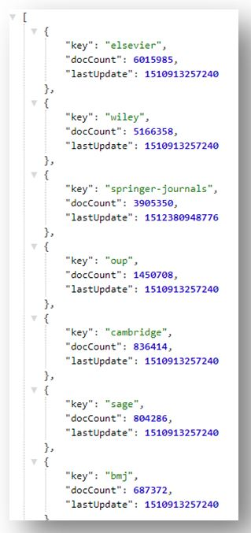

# Comment connaître la liste des corpus chargés dans la plateforme ISTEX ?

Vous pouvez consulter le référentiel [https://loaded-corpus.data.istex.fr/](https://loaded-corpus.data.istex.fr/) qui vous proposera la liste ainsi que des liens web sémantique vers par exemple les éditeurs à qui ISTEX a acheté ces corpus. Exemple :

Vous pouvez également **consulter la liste des corpus chargés sur la plateforme ISTEX directement en consultant son** [**API**](../api/) **:** 

* Pour cela consultez l'URL suivante :[`https://api.istex.fr/corpus/`](https://api.istex.fr/corpus/)
* Vous aurez alors la liste des corpus chargés dans la plateforme ISTEX qui s'affichera au format JSON \(exploitable par les machines\). Exemple :

