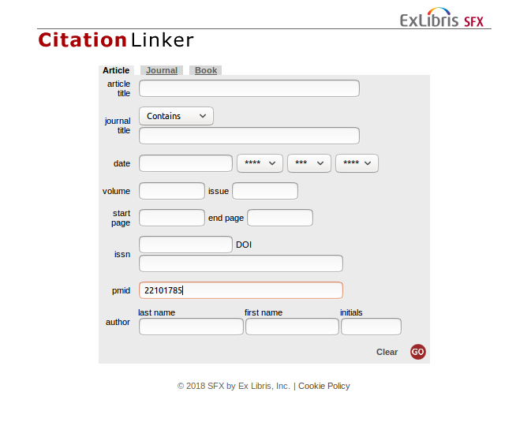

# INRA

- [Intégration du bouton ISTEX dans résolveur de liens](https://doc.istex.fr/users/integration/discovery-tools/#primo-exlibris) dans un parseurv2 créé dans SFX résolveur de liens de Reselec, portail en IST des ressources électroniques de l'INRA
- Un grand merci à Odile Viseux pour cette intégration !

[Voir la documentation technique](https://doc.istex.fr/users/integration/discovery-tools/#2-parametrage-du-resolveur-sfxv2-vers-la-plateforme-istex)

