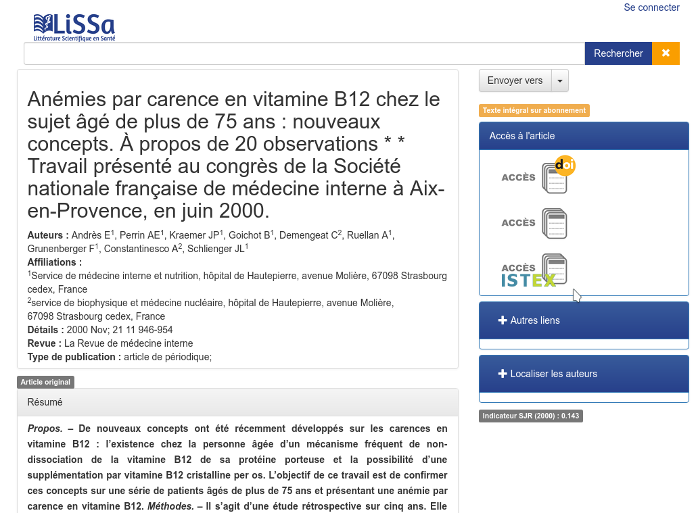

# Intégration du bouton ISTEX

Vous disposez d'un portail documentaire \(exemple : base de données bibliographiques, archive institutionnelle ...\) proposant des ressources documentaires ayant un recoupement avec celles présentes dans la plateforme ISTEX. Vous souhaitez alors afficher un bouton d'accès ISTEX aux _fulltexts_ de ces ressources lorsque ces dernières sont présentes dans la plateforme ISTEX.

C'est par exemple ce que fait la base de donnée bibliographique [LiSSa](http://www.lissa.fr). Lorsque vous arrivez sur [la page d'une ressource](http://www.lissa.fr/fr/rep/articles/11109591) et que cette dernière est présente dans la plateforme ISTEX le site propose alors un bouton d'accès au _fulltext_ de la ressource sur la droite \(le bouton n'est pas affiché dans le cas contraire\) comme vous pouvez le voir sur cette copie d'écran :



Ce bouton peut être intégré dans n'importe quel site web similaire. Il est cependant nécessaire d'avoir des compétences de webmaster et que les ressources possèdent des métadonnées si possible de type identifiants \(ex: PMID ou un DOI\).

Voici alors comment procéder au niveau de votre page HTML en reprenant l'exemple de LiSSa et en utilisant la librairie Javascript jQuery :

```markup
<div class="block" id="istex-button-hook">
  <a onclick="urlClick2Log(this,'FT_NLM','NLM_11109591','SYS_USER_254');" href="http://dx.doi.org/10.1016/S0248-8663(00)00250-2" target="_blank" class="v-button-link block" style="margin-top:0px;margin-right:8px;margin-bottom:0px;margin-left:8px;"></a>
  <a onclick="urlClick2Log(this,'FT_NLM','NLM_11109591','SYS_USER_254');" href="http://linkinghub.elsevier.com/retrieve/pii/S0248866300002502" target="_blank" class="v-button-link block" style="margin-top:0px;margin-right:8px;margin-bottom:0px;margin-left:8px;"></a>
  <script type="text/javascript">
  $.get('https://api.istex.fr/document/openurl?rft_id=info:doi/10.1016/S0248-8663(00)00250-2&noredirect=1&sid=lissa')
    .done(function (res) {
      if (res && res.resourceUrl) {
        var btn = $('<a></a>');
        btn.attr('onclick', "urlClick2Log(this,\'FT_NLM\',\'NLM_11109591\',\'SYS_USER_254\');");
        btn.attr('href', res.resourceUrl);
        btn.attr('target', "_blank");
        btn.attr('class', "v-button-link block");
        btn.attr('style', "margin-top:0px;margin-right:8px;margin-bottom:0px;margin-left:8px;");
        $('#istex-button-hook').append(btn);
      }
    });
  </script>
</div>
```

Vous remarquez que l'[OpenURL de l'API ISTEX](../../api/openurl/) est appelée en AJAX en interrogeant le DOI :

`https://api.istex.fr/document/openurl?rft_id=info:doi/10.1016/S0248-8663(00)00250-2&noredirect=1&sid=lissa`

Vous devrez alors rendre la valeur du DOI paramétrable \(sur notre exemple "10.1016/S0248-8663\(00\)00250-2"\) pour que la vérification de disponibilité de la ressource côté ISTEX puisse se faire en fonction de la ressource actuellement consultée par l'utilisateur.

Pensez également à ajuster votre HTML et le code jQuery pour venir ajouter le bon élément HTML au bon endroit dans votre page web \(notez l'ajout de l'attribut `id="istex-button-hook"`\)

Si possible, merci également d'indiquer `sid=lissa` à la fin de l'appel à l'OpenURL ISTEX en adaptant le mot clé "lissa" à un nom court décrivant votre portail. Ceci permettra à l'équipe ISTEX de récolter des statistiques d'utilisation de la plateforme ISTEX avec un peu de contexte.

**Des intégrations similaires sont réalisées dans différents établissements en France :**

* [Archive ouverte HAL](../examples/ccsd.md)
* [CHU Rouen](../examples/chu-rouen-normandie.md)
* [Institut Laue Langevin  et Synchrotron Européen](../examples/institut-laue-langevin.md)
* [Université Aix Marseille](../examples/amu.md) =&gt; [Code source disponible sur GitHub](https://github.com/SCD-Aix-Marseille-Universite/SMASH/blob/master/resolver.js#L726-L746)
* [Université de Jean Monnet St Etienne](../examples/ujm.md)
* [Université de Paris Saclay](../examples/univ-paris-saclay.md) =&gt;[Code source disponible sur GitHub](https://github.com/istex/istex-button-primo)
* Vous très bientôt ? [dites-le à l'équipe ISTEX](mailto:contact@listes.istex.fr), savoir que la plateforme ISTEX est utilisée par la communauté et comment est très important.

