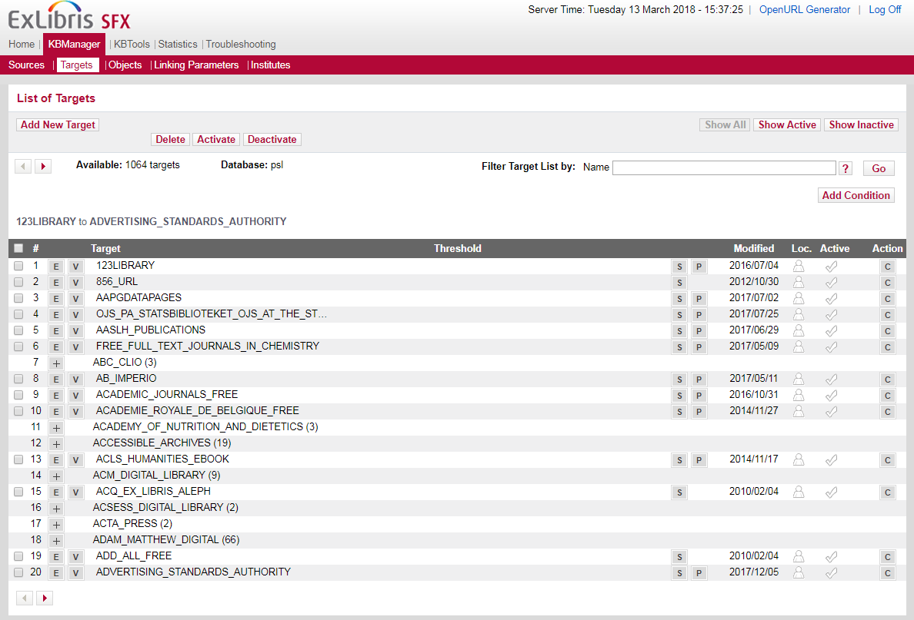
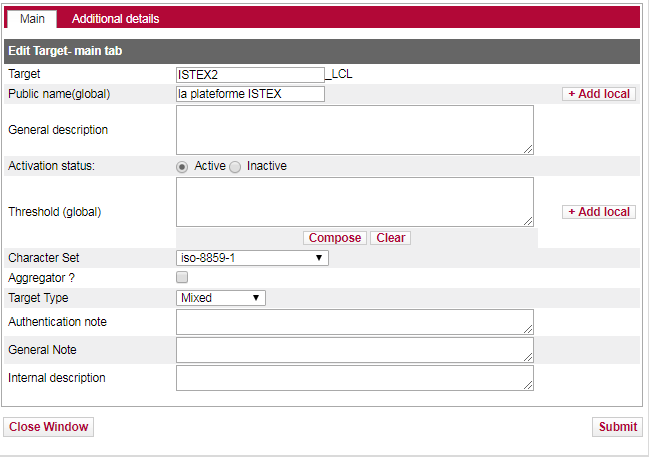
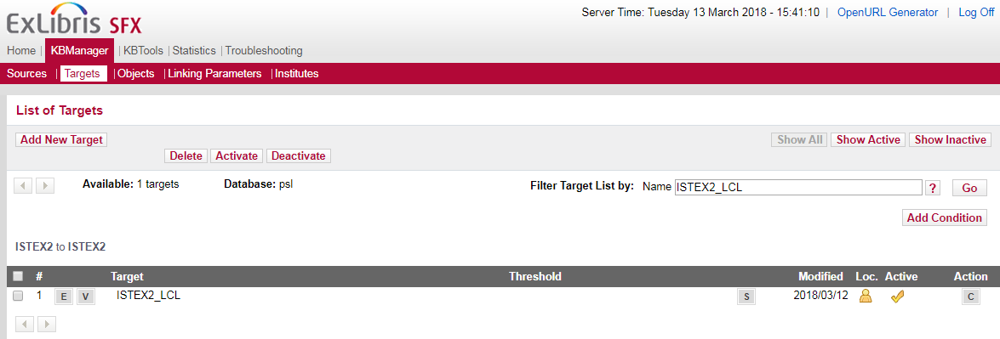
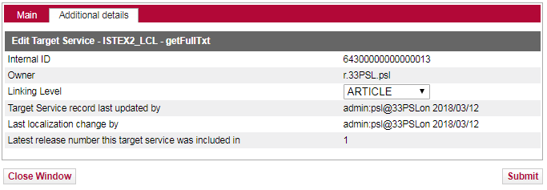

# PRIMO - ExLibris

## 1-Paramétrage du résolveur SFXv1 vers la plateforme ISTEX

* Se rendre dans l'interface d'administration SFX
* Dans l'écran de recherche chercher les Targets ISTEX
* Une liste s'affiche


_Pour info une Target peut être associée à un bouquet de ressources plus un service comme "l'accès au texte intégral" ou **être associée uniquement à un service rebond vers un fournisseur de texte intégal sans bouquet associé**._

Dans notre interface d'administration : 20 Targets sont associées à des bouquets \(bouton “P”\) et **1 Target qui n'est pas associée à un bouquet et qui pointe vers la plateforme ISTEX**

* Activer la target ISTEX en cliquant sur la marque de coche à droite de l'écran


* Cliquer sur le bouton S pour sélectionner un service


* Cliquer sur la marque de coche pour activer le service comme indiquer sur la capture d'écran

_le service getDOI ajoute alors un DOI à l’OpenURL du parseur ISTEX à condition que l’objet \(les métadonnées d’une ressource\) comporte un DOI._

* Cliquer sur le bouton “E” \(edit\) pour afficher le service


* La Target est activée

**Résultat**

* Rechercher l’article _"Disenchantment and the Environmental Crisis"_ dans l’outil de découverte


* Cliquer sur l’onglet “Ressource en ligne” \(résolveur de liens SFX\)

_Le texte intégral disponible chez l’éditeur est affiché dans la partie gauche alors que les services supplémentaires sont accessibles avec le bouton “Plus” situé à droite_


* Cliquer sur “Accès au texte intégral” sur la plateforme ISTEX


Un grand merci à Laurent Aucher pour la création de la target Istex et les contacts avec Ex-libris\(Université PSL/ACEF\)

## 2-Paramétrage du résolveur SFXv2 vers la plateforme ISTEX

Comme on ne peut pas associer à une Target ISTEX un service et un bouquet, cette solution est un mixe de création de Target et de bouton intégré ISTEX.

Un grand merci à Julien Sicot \(Université de Rennes 2\) pour ce développement à partir de la **Target Unpaywall \(ex oaDOI\)**


Cette intégration nécessite un accès SSH à l’instance locale SFX.


### **A- Récupérer le code sur le site** : [https://github.com/jsicot/sfxbur2](https://github.com/jsicot/sfxbur2)

* Parseur : [https://github.com/jsicot/sfxbur2/tree/master/lib/Parsers/TargetParser/ISTEX](https://github.com/jsicot/sfxbur2/tree/master/lib/Parsers/TargetParser/ISTEX)

  Plugin : [https://github.com/jsicot/sfxbur2/tree/master/lib/Parsers/PlugIn](https://github.com/jsicot/sfxbur2/tree/master/lib/Parsers/PlugIn)

* Configuration : [https://github.com/jsicot/sfxbur2/tree/master/config](https://github.com/jsicot/sfxbur2/tree/master/config)

### **B- Création du parseur ISTEX v2**

* Créer un dossier ISTEX2 dans le dossier TargetParser de l’instance locale :`/exlibris/sfx_ver/sfx4_1/[instance]/lib/Parsers/TargetParser/ISTEX2`
* Dans ce dossier, créer un fichier`istexapi.pm` et y copier le code du [Parseur](https://github.com/jsicot/sfxbur2/tree/master/lib/Parsers/TargetParser/ISTEX)

### **C- Création du plugin**

* Se déplacer dans le dossier PlugIn de l’instance locale :`/exlibris/sfx_ver/sfx4_1/[instance]/lib/Parsers/PlugIn`
* Dans ce dossier, créer un fichier `istexapi.pm` et y copier le code du [Plugin](https://github.com/jsicot/sfxbur2/tree/master/lib/Parsers/PlugIn)

### **D- Créer le fichier de configuration**

* Se déplacer dans le dossier config de l’instance locale :`/exlibris/sfx_ver/sfx4_1/[instance]/config/`
* Dans ce dossier, créer un fichier `istex.config`  et y copier le code du fichier de [Configuration](https://github.com/jsicot/sfxbur2/tree/master/config)


les établissements qui utilisent plusieurs instances SFX doivent déposer le parseur, le plugin et le fichier de configuration dans l’instance globale puis créer des liens symboliques pour chaque instance locale vers l’instance globale


```bash
ln -s /exlibris/sfx_ver/sfx4_1/sfxglb41/lib/Parsers/TargetParser/ISTEX2/istexapi.pm
```

```bash
ln –s /exlibris/sfx_ver/sfx4_1/sfxglb41/lib/Parsers/PlugIn/istexapi.pm
```

```bash
ln -s /exlibris/sfx_ver/sfx4_1/sfxglb41/config/istex.config
```

### **E- Création de la target ISTEX2**

* Dans l’interface admin SFX, aller dans Targets, cliquer sur le bouton Add New Target :



* Renseigner les champs, cliquer sur le bouton Submit :



### **F- Création du service**

* Cliquer sur le bouton S :



* Dans l’écran des services, cliquer sur le bouton Add New Service :


* Renseigner les champs des deux onglets \(personnaliser le sid\) puis cliquer sur le bouton Submit :




### G- Des intégrations similaires sont réalisées dans différents établissements en France :

* [INRA](https://doc.istex.fr/users/integration/exemples/#inra)
* [Université Rennes2](https://doc.istex.fr/users/integration/exemples/#universite-rennes2) =&gt; [Code source disponible sur GitHub](https://github.com/jsicot/sfxbur2)
* [Université Paris Sciences Lettres](https://doc.istex.fr/users/integration/exemples/#universite-paris-sciences-lettres)
* Vous très bientôt ? [dites-le à l'équipe ISTEX](mailto:contact@listes.istex.fr), savoir que la plateforme ISTEX est utilisée par la communauté et comment est très important.

