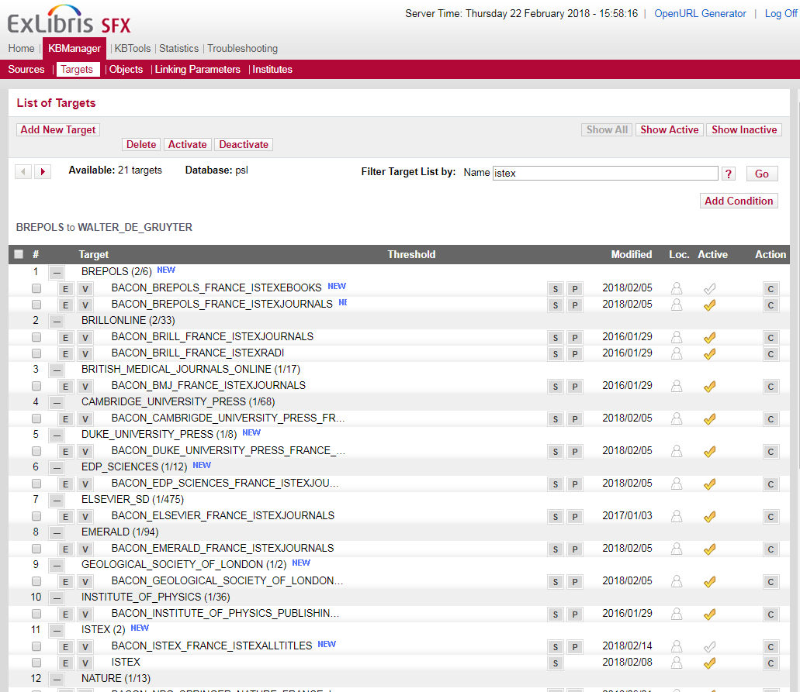
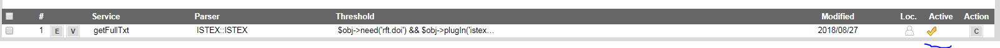
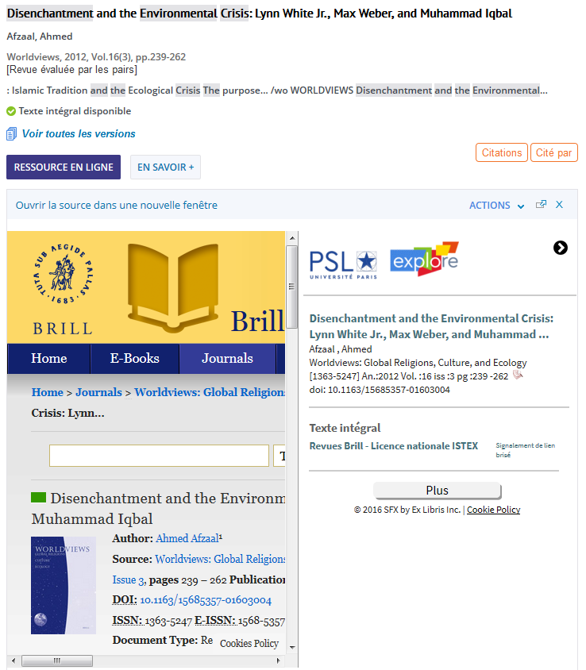
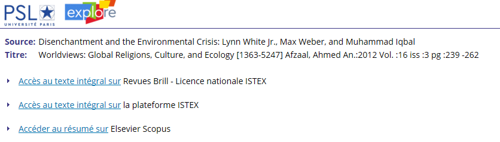
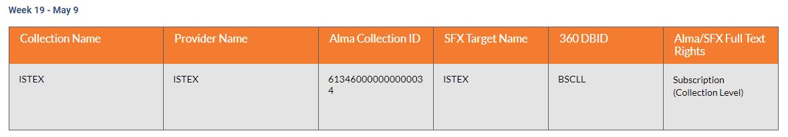

# PRIMO / Alma - ExLibris

## 1-Paramétrage du résolveur SFXv1 vers la plateforme ISTEX \(_Obsolète_\)

_Ce paramétrage est obsolète car le **parser SFXv2 a été intégré par EXLibris à la KB SFX depuis la mise à jour du mois d'août V4\_0\_SFX\_Update\_20183400.**_

_=**&gt;** **Voir ci-dessous** `2-Paramétrage du résolveur SFXv2 vers la plateforme ISTEX`_

_Un grand merci à Julien Sicot \(Université de Rennes 2\) pour le parser ISTEXv2 et à Laurent Aucher \(Université PSL/ACEF\) pour ses interventions répétée auprès d'ExLibris_

## 2-Paramétrage du résolveur SFXv2 vers la plateforme ISTEX \(_Obsolète_\)

_L’interrogation de la plateforme ISTEX est basée sur le résolveur de liens SFX._

_Le parseur SFX v2 , développé par Julien Sicot \(_ [_https://github.com/jsicot/sfxbur2_](https://github.com/jsicot/sfxbur2) _\) a été intégré à la base de connaissance SFX dans la mise à jour d'août 2018 \(20183400\)_

### _**A-** Rechercher la target ISTEX dans la base de connaissance_

### _**B-** Activer la target ISTEX en cliquant sur la marque de coche à droite de l'écran_

### _**C-** Cliquer sur le bouton S pour sélectionner un service_

### _**D-** Activer le service ISTEX en cliquant sur la marque de coche à droite de l'écran_

### _E-La target est activée_

### _**F- Résultat**_

* _Rechercher l’article "**Disenchantment and the Environmental Crisis**" dans l’outil de découverte_

* _Cliquer sur l’onglet **“Ressource en ligne”** \(résolveur de liens SFX\)_

* _Le texte intégral disponible chez l’éditeur est affiché dans la partie gauche alors que les services supplémentaires sont accessibles avec le bouton **“Plus”** situé à droite_

* _Cliquer sur **“Accès au texte intégral”** sur la plateforme ISTEX_

_Un grand merci à Julien Sicot \(Université de Rennes 2\) pour le parser ISTEXv2 et à Laurent Aucher \(Université PSL/ACEF\) pour ses interventions répétée auprès d'ExLibris_

### G- Des intégrations similaires sont réalisées dans différents établissements en France :

* [INRA](https://doc.istex.fr/users/integration/exemples/#inra)
* [Université Rennes2](https://doc.istex.fr/users/integration/exemples/#universite-rennes2) =&gt; [Code source disponible sur GitHub](https://github.com/jsicot/sfxbur2)
* [Université Paris Sciences Lettres](https://doc.istex.fr/users/integration/exemples/#universite-paris-sciences-lettres)
* Vous très bientôt ? [dites-le à l'équipe ISTEX](mailto:contact@listes.istex.fr), savoir que la plateforme ISTEX est utilisée par la communauté et comment est très important.

## 3- ISTEX disponible dans l'Index central de découverte  \(CDI\)

ISTEX est accessible depuis le 9 mai 2021 dans l'index central PRIMO et Alma 

Un grand merci à tous pour ce travail collaboratif! 

