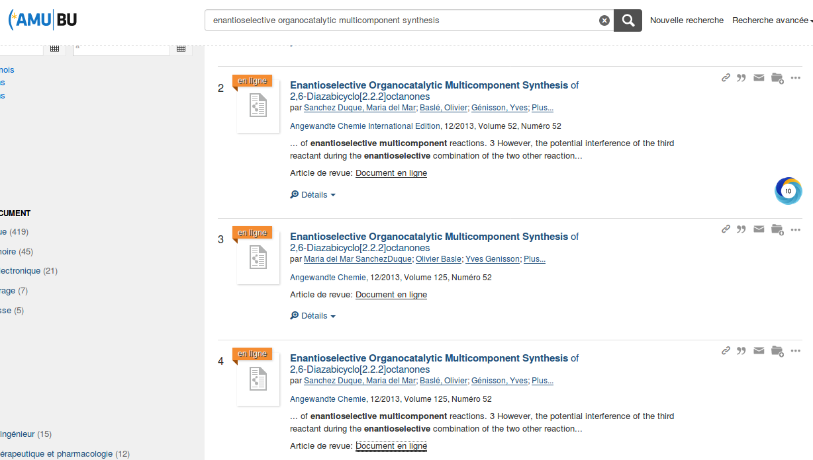

# Université Aix Marseille

* [Intégration du bouton ISTEX](https://doc.istex.fr/users/integration/ent-web/#bouton-istex-integre) dans un résolveur de liens SMASH pour une solution de découverte"Summon" \( [voici un exemple](https://sh2hh6qx2e.search.serialssolutions.com/?url_ver=Z39.88-2004&ctx_ver=Z39.88-2004&rfr_id=info%3Asid%2Fzotero.org%3A2&rft_id=info%3Adoi%2F10.1002%2Fanie.201306656&rft_val_fmt=info%3Aofi%2Ffmt%3Akev%3Amtx%3Ajournal&rft.genre=article&rft.atitle=Enantioselective%20Organocatalytic%20Multicomponent%20Synthesis%20of%202%2C6-Diazabicyclo%5B2.2.2%5Doctanones&rft.jtitle=Angewandte%20Chemie%20International%20Edition&rft.stitle=Angew.%20Chem.%20Int.%20Ed.&rft.volume=52&rft.issue=52&rft.aufirst=Maria%20del%20Mar&rft.aulast=Sanchez%E2%80%85Duque&rft.au=Maria%20del%20Mar%20Sanchez%E2%80%85Duque&rft.au=Olivier%20Basl%C3%A9&rft.au=Yves%20G%C3%A9nisson&rft.au=Jean-Christophe%20Plaquevent&rft.au=Xavier%20Bugaut&rft.au=Thierry%20Constantieux&rft.au=Jean%20Rodriguez&rft.date=2013-12-23&rft.pages=14143-14146&rft.spage=14143&rft.epage=14146&rft.issn=1521-3773&rft.language=en) \)
* Un grand merci à Laurent Lhuillier pour cette intégration !

[Code source disponible sur GitHub](https://github.com/SCD-Aix-Marseille-Universite/SMASH/blob/master/resolver.js#L726-L746)

