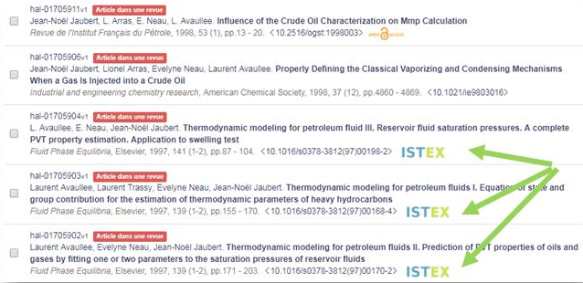

# CNRS CCSD

* [Intégration du bouton ISTEX](https://doc.istex.fr/users/integration/ent-web/#bouton-istex-integre) dans les Archives ouvertes pluridisciplinaires HAL ([voici un exemple](https://hal.archives-ouvertes.fr/hal-01705904))
* Un grand merci à Yannick Barborini et toute son équipe pour cette intégration !

Dans HAL, la notice est enrichie avec un lien vers le texte intégral lorsque celui-ci est disponible en libre accès sur une autre plateforme comme arXiv ou PubMed Central. Le bouton d'accès Istex s’affiche si la ressource n’existe pas en libre accès mais est disponible sur la plateforme Istex.

[Voir la documentation technique](https://doc.istex.fr/users/integration/ent-web/#bouton-istex-integre)
