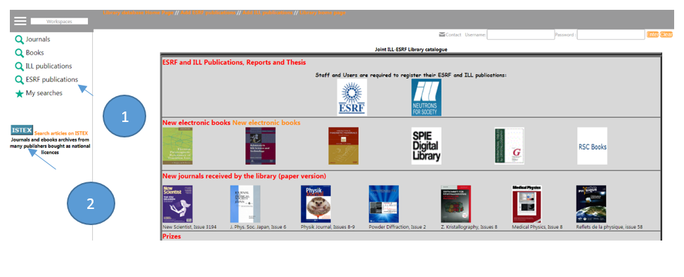

# Institut Laue Langevin et Synchrotron Européen



* [Intégration du bouton ISTEX](../bouton/) (1) dans l’interface de recherche de « Flora » renommée [Joint ILL-ESRF Library catalogue ](https://epn-library.esrf.fr/flora/). [voir l'exemple](https://epn-library.esrf.fr/flora/jsp/portal/index.jsp?record=doc:PUB_ESRF:32023\&action=opac_direct_view\&success=/jsp/portal/index.jsp\&profile=anonymous)
* [Code source des widgets sur github  ](https://github.com/istex/istex-widgets-angular)[voir l’exemple](http://www.epn-campus.eu/index.php?id=834)&#x20;
* Un grand merci à Sophie Rio pour ces 2 intégrations !&#x20;
* Ci dessous le code source HTML/Javascript de l’intégration dans Flora&#x20;

```markup
<span id="istex-button-hook">
  <script type="text/javascript">
    var xhr = new XMLHttpRequest();
    if (xhr) {
      xhr.onreadystatechange = alertXHR;
      xhr.open('GET', 'https://api.istex.fr/document/openurl?rft_id=info:doi/{value}&noredirect=1&sid=epn');
      xhr.send();
    }

    function alertXHR() {
      if (xhr.readyState === XMLHttpRequest.DONE) {
        if (xhr.status === 200) {
          var istexResponse = JSON.parse(xhr.responseText);
          var btn = document.createElement('a');
          btn.setAttribute('href', istexResponse.resourceUrl);
          btn.setAttribute('target', '_blank');
          btn.setAttribute('style', 'margin-top:0px;margin-right:8px;margin-bottom:0px;margin-left:8px;');
          var img = document.createElement('img');
          img.setAttribute('src', 'https://epn-library.esrf.fr/flora/icons/css/flora2/visual/ISTEX.GIF');
          img.setAttribute('style', 'width:50px;vertical-align:middle');
          img.setAttribute('alt', 'ISTEX');
          btn.appendChild(img);
          var istexButtonElement = document.getElementById('istex-button-hook');
          istexButtonElement.textContent = 'Direct link to the PDF via';
          istexButtonElement.appendChild(btn);
        } 
      }
    }
  </script>
</span>
```
