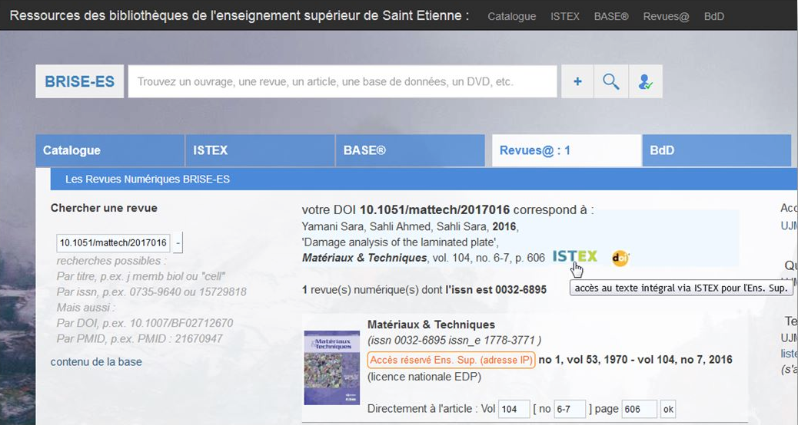

# Université Jean Monnet St Etienne

* [Intégration du bouton ISTEX](https://doc.istex.fr/users/integration/ent-web/#bouton-istex-integre) dans le portail des ressources des bibliothèques de l'enseignement supérieur de Saint Etienne BRISE-ES et Intégration profonde de l'API par opposition aux widgets prêtes à l'emploi ([voici un exemple](https://dossier-ng.univ-st-etienne.fr/scd/www/ent/PagesEnt/interro_doi_pmid_zbl.php/?valeur=10.1051%2Fmattech%2F2017016))&#x20;
* Un grand merci à Dominique Rouger pour cette intégration !

En recherchant un article dans le BRISE-ES, le portail des ressources des bibliothèques de l'enseignement supérieur de Saint Etienne, on a le lien vers un document Istex au niveau du catalogue et les résultats uniquement dans Istex.

[Voir la documentation technique](https://doc.istex.fr/users/integration/ent-web/#bouton-istex-integre)
