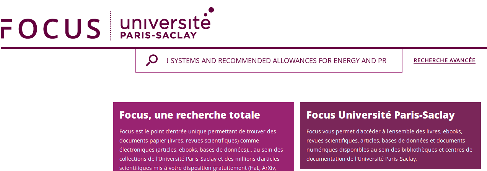

# Université Paris Saclay

* [Intégration du bouton ISTEX](https://doc.istex.fr/users/integration/ent-web/#bouton-istex-integre) dans l'outil de découverte Primo, renommé FOCUS à l'Université Paris-Saclay \([voici un exemple](https://focus.universite-paris-saclay.fr/primo-explore/search?query=any,contains,The%20French%20horse%20feed%20evaluation%20systems%20and%20recommended%20allowances%20for%20energy%20and%20protein&tab=default_tab&search_scope=default_scope&vid=33PUP_VU1&lang=fr_FR&offset=0)\)
* Un grand merci à Camille Maze et Vincent Thébault pour cette intégration !
* Vous pouvez consulter l'[exemple en ligne sur une notice de FOCUS](https://focus.universite-paris-saclay.fr/primo-explore/fulldisplay?docid=TN_proquest199056078&context=PC&vid=33PUP_VU1&lang=fr_FR&search_scope=default_scope&adaptor=primo_central_multiple_fe&tab=default_tab&query=any,contains,brain&sortby=rank&offset=0).
* Et si vous souhaitez consulter le [code source de l'intégration, vous pouvez le trouver sur Github](https://github.com/istex/istex-button-primo)

