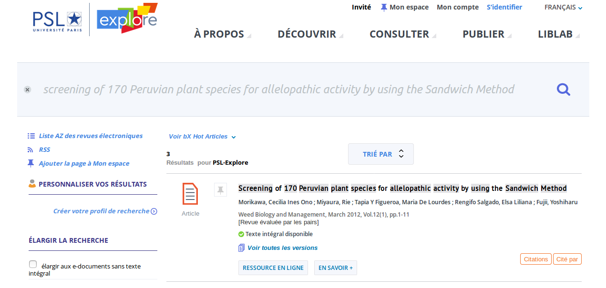

# Université Paris Sciences Lettres

* Création d'un parseurv1 dans SFX pour [intégration d'ISTEX dans solution de découverte](https://doc.istex.fr/users/integration/discovery-tools/#primo-exlibris) Primo du portail PSL-Explore
* Un grand merci à Laurent Aucher pour cette intégration !

_Cliquer sur RESSOURCE EN LIGNE_

\[\]\([http://beryl.univ-psl.fr/primo\_library/libweb/action/search.do;jsessionid=90A9221777D87F6C8BBE69C23D19DE94?cs=frb&ct=frb&frbg=5367184117619193977&fctN=facet\_frbrgroupid&fctV=5367184117619193977&doc=TN\_wj10.1111%2fj.1445-6664.2011.00429.x&lastPag=&lastPagIndx=&rfnGrp=frbr&frbrRecordsSource=Primo+Central&frbrJtitleDisplay=Weed+Biology+and+Management&frbrIssnDisplay=1444-6162&frbrEissnDisplay=1445-6664&frbrSourceidDisplay=wj&vid=33PSL\_V1&fn=search&indx=1&dscnt=0&vl\(freeText0\)=screening of 170 Peruvian plant species for allelopathic activity by using the Sandwich Method&dstmp=1524058289966](http://beryl.univ-psl.fr/primo_library/libweb/action/search.do;jsessionid=90A9221777D87F6C8BBE69C23D19DE94?cs=frb&ct=frb&frbg=5367184117619193977&fctN=facet_frbrgroupid&fctV=5367184117619193977&doc=TN_wj10.1111%2fj.1445-6664.2011.00429.x&lastPag=&lastPagIndx=&rfnGrp=frbr&frbrRecordsSource=Primo+Central&frbrJtitleDisplay=Weed+Biology+and+Management&frbrIssnDisplay=1444-6162&frbrEissnDisplay=1445-6664&frbrSourceidDisplay=wj&vid=33PSL_V1&fn=search&indx=1&dscnt=0&vl%28freeText0%29=screening%20of%20170%20Peruvian%20plant%20species%20for%20allelopathic%20activity%20by%20using%20the%20Sandwich%20Method&dstmp=1524058289966)\)

[Voir la documentation technique](https://doc.istex.fr/users/integration/discovery-tools/#1-parametrage-du-resolveur-sfxv1-vers-la-plateforme-istex)

