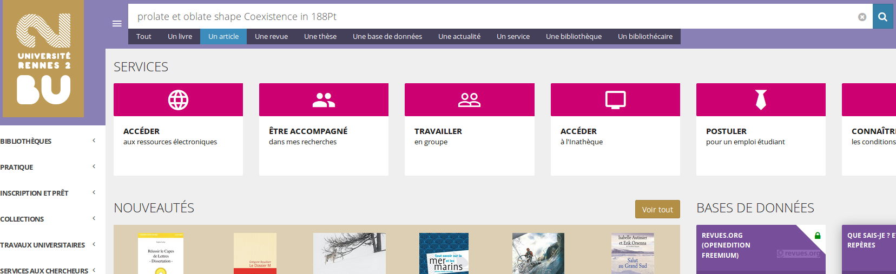

# Université Rennes 2

* [Intégration bouton ISTEX dans résolveur de liens](https://doc.istex.fr/users/integration/discovery-tools/#primo-exlibris) dans un parseurv2 créé dans SFX
* Un grand merci à Julien Sicot pour cette intégration !

[Code source disponible sur GitHub](https://github.com/jsicot/sfxbur2)

