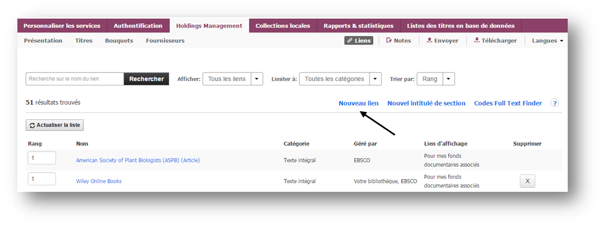
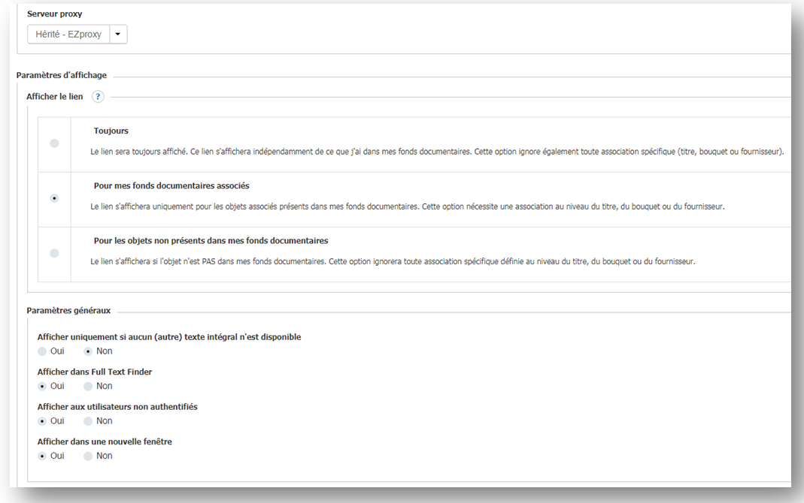
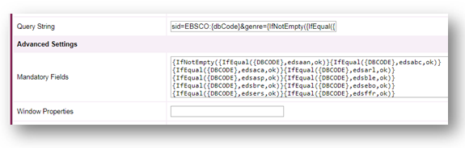
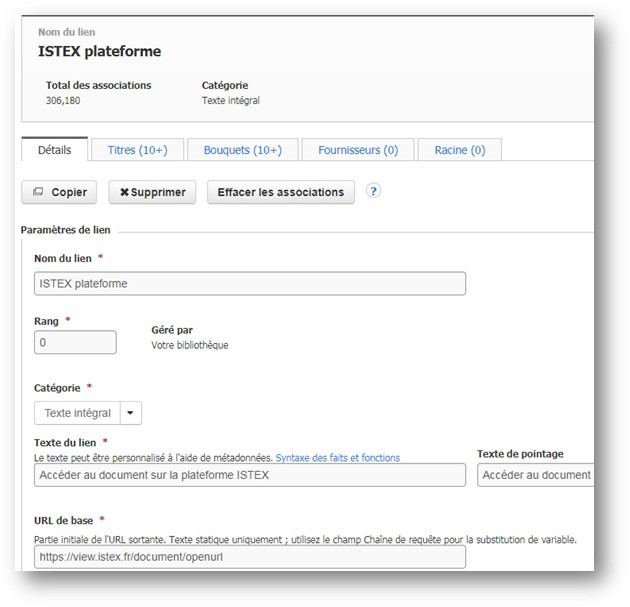
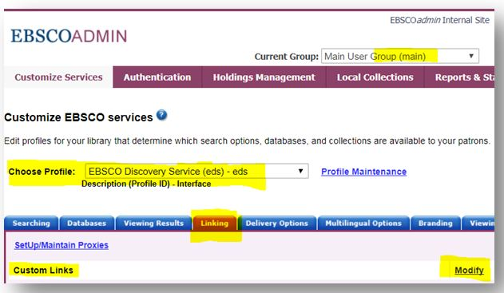
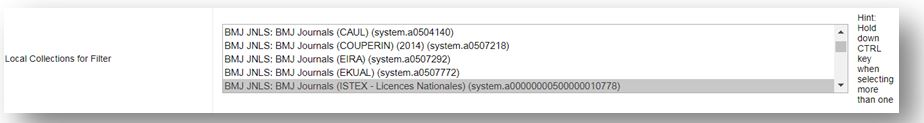
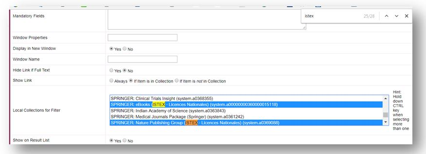
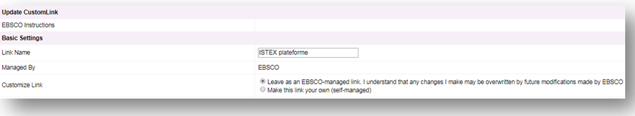
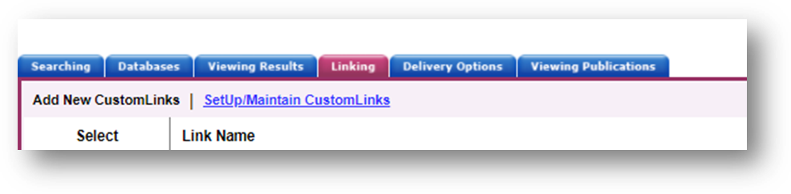
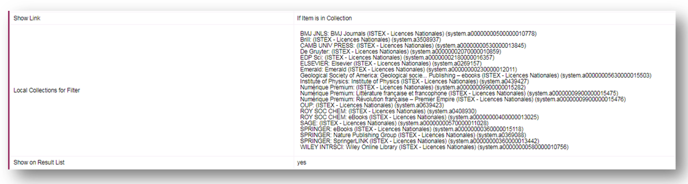

# EDS - EBSCO

**Accès au PDF après une recherche**

Une recherche sur l’article suivant : _Tricuspid incompetence and right ventricular output in congestive heart failure_ de la revue **British Heart Journal Janvier 1957, Vol. 19 Issue 1**, du bouquet BMJ ISTEX

Deux propositions d'accès au PDF :

* Directement à partir de la plateforme ISTEX par OpenURL avec pérennité de l’accès
* Ou par rebond à partir du site de l'éditeur via le résolveur de lien FTF d'EBSCO

L'accès direct au document sur la plateforme ISTEX est possible de 2 façons en fonction des habitudes de travail.

**1- FTF/Résolveur de lien : En créant un lien Open URL et en lui assignant des bouquets**

**2- EDS/Customlinks : En utilisant le CustomLink d'EBSCO**

## 1- FTF/Résolveur de lien

Le Holdings Management \(HLM\) dans EBSCOADMIN permet à l’administrateur du compte de gérer les collections ou abonnements et leur associer un résolveur de liens permettant l’accès au plein texte sur le site de l’éditeur.

**A- Liens éditeurs pour Bouquets ou Titres de ressources**

Dans le HLM en cliquant sur **"Liens"**, l’administrateur peut visualiser les liens éditeurs disponibles dans le module d'administration qu'il faudra associer à un **"Titres"** ou un **"Bouquet"** de ressources pour aller jusqu'au plein texte. Dans notre exemple : 51 liens sont disponibles

**B- Création d'un lien vers la plateforme ISTEX**

Cliquer sur **"Nouveau lien"**

Remplir le formulaire **"Url\* de base"**

Avec `https://view.istex.fr/document/openurl`

Au niveau de la **"Chaîne de requête"** préciser le champ DOI et PMID plus le mode et l'ordre d'authentification : IP puis Fédération d'identité

`?rft_id=info:doi/{DOI}&rft_id=info:pmid/{PMID}&sid=ebsco&auth=ip,fede`

Ainsi que les métadonnées prises en compte :

`{IfNotEmpty({DOI}{PMID},ok,)}`

Ne pas oublier de cocher l'affichage du lien "Pour mes fonds documentaires associés"

Pour personnifier l'affichage du lien, rajouter l’icône ISTEX dont l'URL est :

`https://content-delivery.istex.fr/assets/img/istex-minilink.png`

**C- OpenURL sur le champ PMID**

L'Open URL ne se fait pas que sur le champ DOI mais également sur le champ PMID et les résultats sont d'autant plus performants que 4 000 000 de PMID ont été ingérés dans la plateforme ISTEX. Il faut donc au préalable en plus de rajouter le PMID dans le paramétrage au moment de la création du lien "ISTEX Plateforme", modifier l'équation dans le résolveur de lien.

=&gt; EDS/Linking/Custom Links puis Modify

=&gt; Choisir SetUp MaintainCustomLink

=&gt; Sélectionner le résolver de lien FullTextFinder

=&gt; Dans Query String, vérifier

=&gt; et complèter l'équation.

**D- Open URL : erreur 404 et Istex View**

Il peut y avoir une différence de contenu entre la liste des revues négociées avec les éditeurs, disponible au format Kbart sur le site des licences nationales, et les documents, réellement livrés en xml, disponibles sur la plateforme ISTEX.

=&gt; Un message code 404 peu **user friendly** s’affiche :

=&gt; **Une couche IHM** \(pour interface Homme-Machine\) a été développée et rajoutée au-dessus de l'API ISTEX et en particulier de son OpenURL pour permettre l’affichage d’un message plus explicite pour l’utilisateur.  
Il suffit pour le voir de remplacer `https://api.istex.fr/document/openurl` \(Pour ceux qui ont paramétré le lien avant ISTEX View\) par `https://view.istex.fr/document/openurl` dans le champ **« URL\* de base »** de la fenêtre de paramétrage du lien ISTEX plateforme.

=&gt;Le message devient :

**E- Assigner le lien aux bouquets concernés**

Une fois le lien créé il faut l’assigner à tous les bouquets Licences Nationales ISTEX déjà présents dans la plateforme ISTEX :

* Les rechercher 
* Les associer au lien OpenURL 

### **!!!ATTENTION!!!**

Seuls les bouquets suivants sont déjà disponibles sur la plateforme ISTEX.

21 négociations mais 22 bouquets à sélectionner car la négociation "Numérique Premium" comporte 2 bouquets "Révolution française-Premier Empire" et "Littérature française et francophone".

#### 22 bouquets à associer

* BMJ Journals \(ISTEX - Licences Nationales\)
* BRILL \(ISTEX - Licences Nationales\)
* Brill Recueils des cours de l’Académie de La Haye \(ISTEX -Licences Nationales\)
* Cambridge University Press \(ISTEX - Licences Nationales\)
* De Gruyter \(ISTEX - Licences Nationales\)
* EarlyEnglish Books Online \(EEBO\)
* EDP Sciences \(ISTEX - Licences Nationales\)
* EighteenthCentury Collections Online
* Elsevier \(ISTEX - Licences Nationales\)
* Emerald\(ISTEX - Licences Nationales\)
* Geologicalsociety of London Publishing – ebooks \(ISTEX - Licences Nationales\)
* Institute of Physics \(ISTEX - Licences Nationales\)
* Littérature française et francophone \(ISTEX - LicencesNationales\)
* Nature Publishing Group \(ISTEX - Licences Nationales\)
* OxfordUniversity Press \(ISTEX - Licences Nationales\)
* Révolution française – Premier Empire \(ISTEX - LicencesNationales\)
* RoyalSociety of Chemistry \(ISTEX - Licences Nationales\)
* RoyalSociety of Chemistry eBooks \(ISTEX - Licences Nationales\)
* SAGE \(ISTEX - Licences Nationales\)
* Springer Nature eBooks \(ISTEX - Licences Nationales\)
* SpringerLINK \(ISTEX - Licences Nationales\)
* Wiley Online Library \(ISTEX - Licences Nationales\)

## 2- EDS/Customlinks

Contrairement au cas précédent ou un lien plateforme est créé par l'utilisateur, cette fois c'est EBSCO qui gère le CustomLink l'utilisateur choisit d'associer des System collections \(champ Local collection for filter\) au Customlink ISTEX Plateforme créé par EBSCO.

L’activation par l’administrateur du compte se passe dans le sous onglet Linking du ou des Group\(s\) et profil\(s\) concernés. Elle sera à répéter pour chaque profil et ou Group. Exemple le plus fréquent, Group Main, profil \(eds\), onglet Linking, puis Customlinks / lien Modify.

**A- Premier cas : ISTEX plateforme est déjà activé parmi les customlinks EDS**

1. Cliquer sur SetUp/Maintain CustomLinks
2. Descendre jusqu’au lien ISTEX plateforme et cliquer sur le lien
3. Descendre jusqu’à la fonction Local Collections for Filter

   

4. Appuyer sur la touche ctrl du clavier et en même temps cliquer sur la source déjà sélectionnée \(si elle se désélectionne, la cocher de nouveau sans lâcher la touche ctrl\)
5. Toujours en appuyant sur la touche ctrl, appuyer sur la touche F du clavier pour ouvrir le champ de recherche dans la page et tapez ISTEX pour aller à toutes les occurrences du mot.

   

6. Utiliser les flèches du champ de recherche pour naviguer d’occurrence en occurrence.
7. Sans lâcher la touche ctrl, sélectionner la/les nouvelle\(s\) source\(s\) choisie\(s\) puis valider.

**B - Deuxième cas : ISTEX plateforme n’est pas activé parmi les customLinks EDS**

1. Cliquer sur SetUp/Maintain CustomLinks
2. Cliquer sur Add New CustomLink
3. Cocher “Copy from existing CustomLink » et cliquer sur Continue
4. Dans Choose Category, sélectionner Full Text et cliquer sur ++show other available CustomLinks
5. Descendre jusqu’au lien ISTEX plateforme et cliquer sur le lien
6. Descendre jusqu’à la fonction Local Collections for Filter
7. Suivre les étapes 4 à 7 de du Cas N°1

   **C - Précautions**

8. Au moment de créer un Custom Link, si on veut pouvoir rajouter des corpus, il faut qu'EBSCO nous les propose et pour cela il faut impérativement sélectionner:

"leave as an EBSCO-managed link..."

* Il est possible de vérifier les corpus présents dans le custom link ISTEX plateforme en sélectionnant:

Linking/Add New CustomLinks

Chercher ISTEX plateforme et cliquer sur Go

Voir la rubrique : Local Collections for Filter

