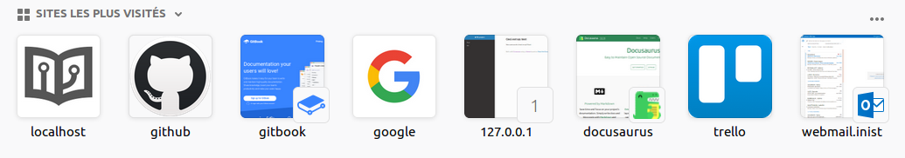

# On à créé une page

Nous voici sur une nouvelle page

| Exemples de contenus | Modalité d’interrogation |
| --- | --- | --- | --- | --- | --- | --- | --- |
| **Un domaine** | Recherche par catégories scientifiques \(selon les classifications Science-Metrix, Web of Science ou Pascal-Francis\) sur les champs dédiés aux enrichissements ISTEX : `categories.scienceMetrix`, `categories.wos`, `categories.inist` |
| **Une thématique, un sujet** | Recherche par mots ou par expressions soit sur tous les champs, soit sur les champs `title`, `abstract`, ou `subject.value`. Enumérer un maximum de synonymes et de variantes |
| **Une date de publication** | Recherche par date sur le champ `publicationDate` ou `copyrightDate` |
| **Un type de publication** \(monographie, revue, etc.\) | Recherche par type sur le champ `host.genre` |
| **Un type de contenu** \(article, résumé, chapitre, etc.\) | Recherche par type sur le champ `genre` |
| **Une langue de document** | Recherche par code langue sur le champ `language` |
| **Une revue** | Soit recherche par le nom de la revue sur le champ `host.title` Soit recherche par l’ISSN sur le champ `host.issn` |

## Ceci et un titre 2

