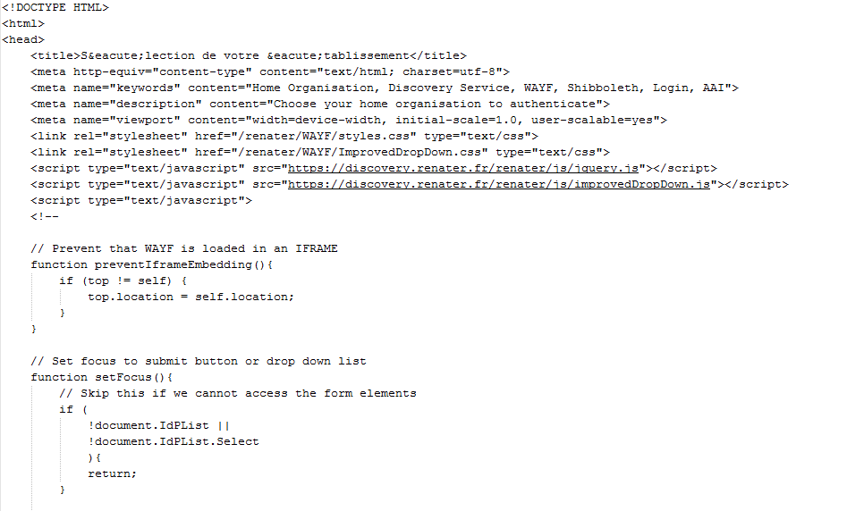

# Détecter les problèmes d'authentification

Pendant l’extraction, il est possible que le programme perde la connexion avec le serveur et soit redirigé vers la page d’authentification de la fédération d’identité. C’est le cas lorsque le programme d’extraction fonctionne pendant la nuit, au moment où la liste des IP autorisés est rechargée par l’API, ce qui occasionne une non reconnaissance momentanée de l'adresse IP de la machine. Dans ce cas, le fichier extrait contient non pas le document souhaité, mais la page HTML d'authentification par la fédération d’identité.

Le texte du document ne correspond alors plus au document souhaité et peut ainsi générer du bruit dans les analyses thématiques ou dans l'analyse du silence dans les détections d'entités spécifiques.

Ci-dessous un exemple de fichier extrait (`Vieil_00718.txt` issu du Corpus Vieillissement V2 old):



Ce phénomène est aléatoire et peut survenir sur n'importe quel document, lors d'une extraction de nuit.

Dans ce cas, il faut simplement vérifier que le corpus ne contient pas de document HTML même si l'extension indique .txt, .zip, .pdf, etc.

Le programme suivant permet de réaliser cette action pour les fichiers extraits et renommés par l'outil `harvestCorpus.pl` (selon modèle de renommage « nomCorpus\_&#x30;_&#x6E;n_ » où « _0nn_ » est un nombre) :

```bash
for i in nomCorpus_0*
do
j=`file $i | egrep -c 'HTML document'`
if [ $j != 0 ]
then
echo $i
fi
done
```

Si le programme détecte un document HTML, il faut relancer l'extraction et recommencer la vérification.
