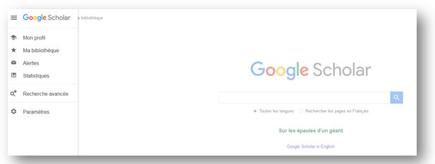
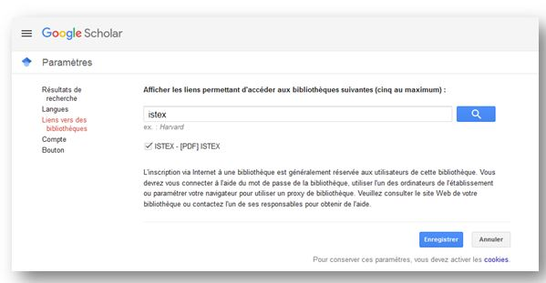
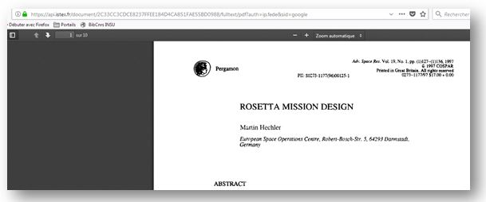

# Google Scholar

## OpenURL et diffusion d'ISTEX à travers Google Scholar

Comme pour tous les autres modes d’accès au PDF, il est limité aux ayants droit ISTEX, c'est-à-dire les personnels de l'Enseignement Supérieur et de la Recherche.

Il est possible au cours d'une recherche sur Google Scholar d'avoir accès via une OpenURL au pdf du document présent sur la plateforme ISTEX.

A chaque chargement d'un nouveau corpus sur la plateforme ISTEX un formulaire est adressé à Google Scholar pour leur demander l'activation des liens OpenURL pour les ressources présentes dans les fichiers Kbart disponibles sur le site le BACON en XML \(fournis par ABES\).

Google Scholar indique que l'activation \(et la mise à jour\) prend une à deux semaines.

## Paramètrage pour l'utilisateur

**Paramètrage à faire une seule fois**

* Aller sur Google Scholar
* Cliquer en haut à gauche pour voir les paramètrages

* Choisir "Paramètres"
* Puis "Liens vers des bibliothèques"

* Rechercher ISTEX
* Sélectionner
* Retourner à votre recherche

* \[PDF\]ISTEX signale un lien disponible

* Accèder au PDFdisponible sur la plateforme ISTEX

**Autre possibilité**

L'option de sélectionner le lien vers la bibliothèque ISTEX est proposée automatiquement au moment de l'installation du bouton ISTEX voir [**Bouton ISTEX**](https://doc.istex.fr/users/usage/button/)

